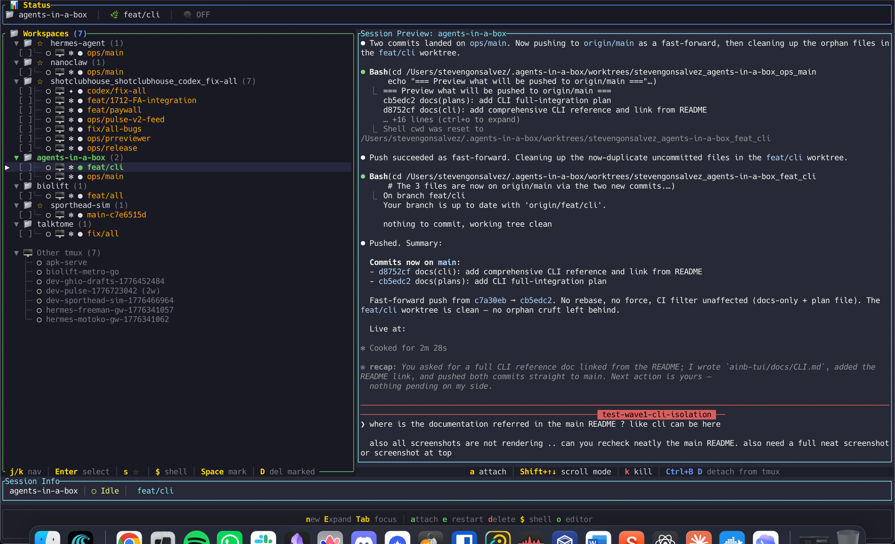
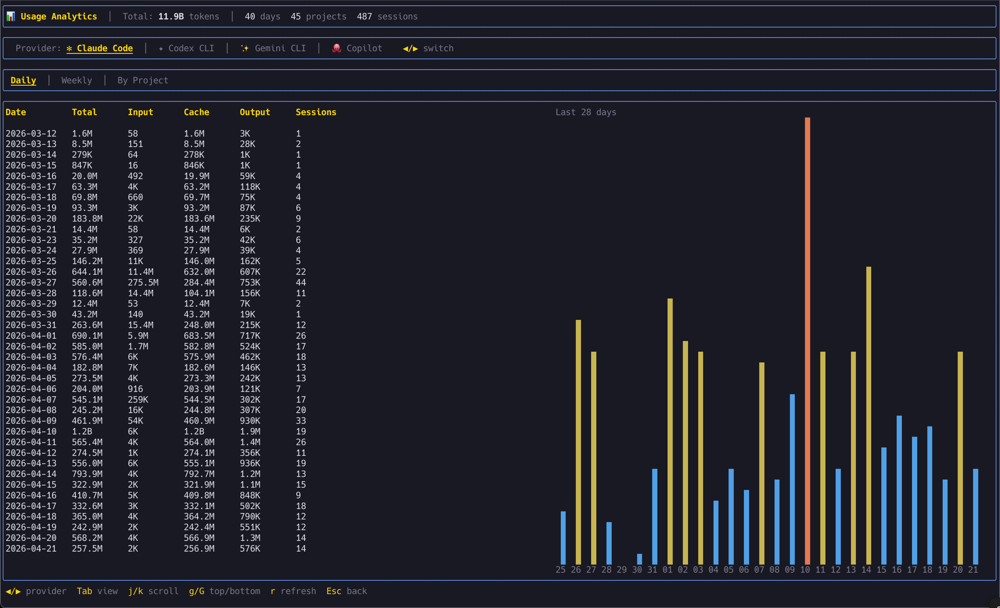
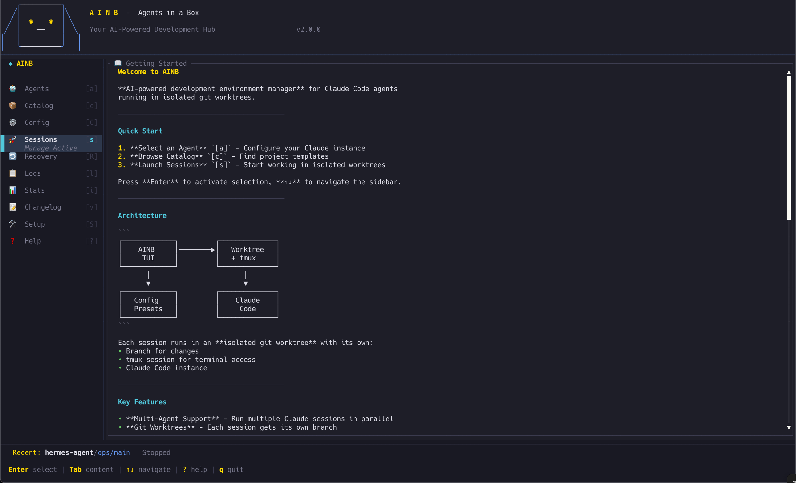
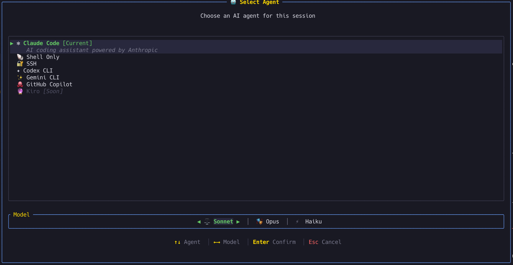
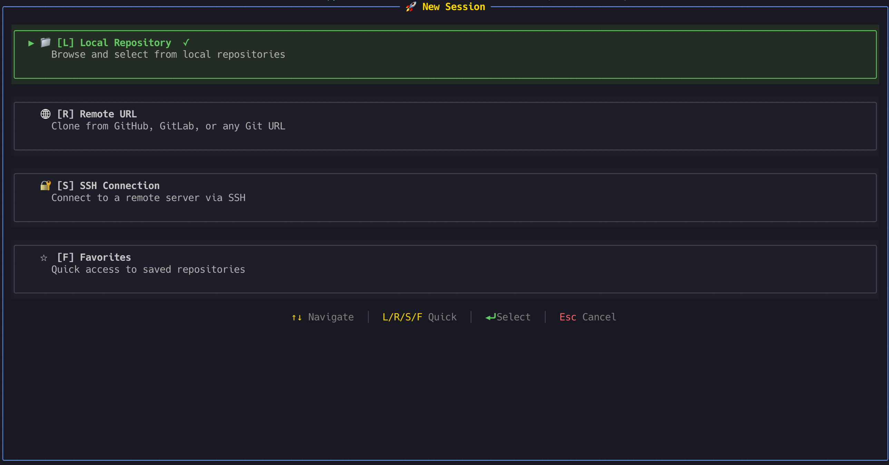
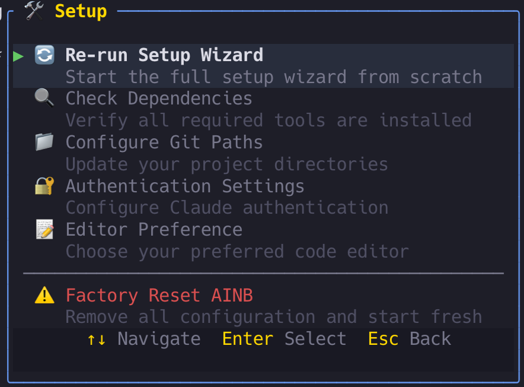
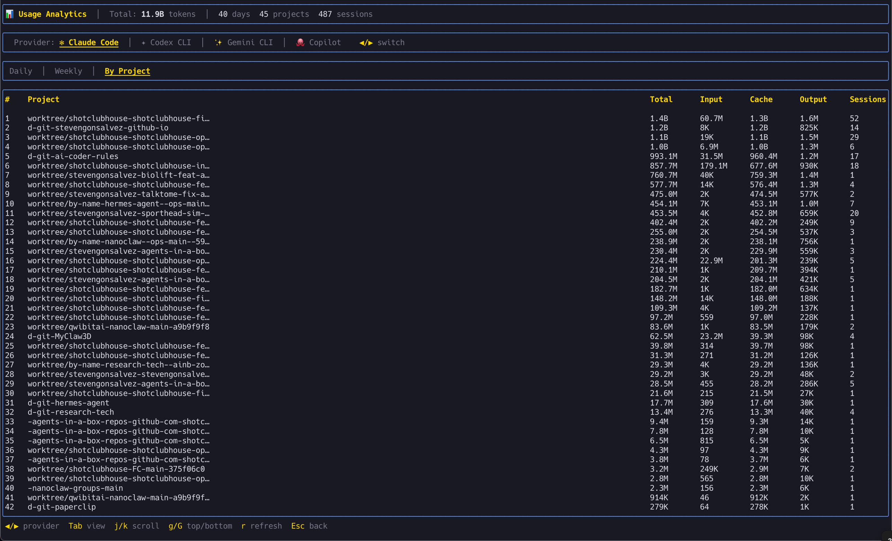

<p align="center">

```
   ╔═══════════════════════════════════════════════════════════════╗
   ║                                                               ║
   ║     █████╗  ██████╗ ███████╗███╗   ██╗████████╗███████╗       ║
   ║    ██╔══██╗██╔════╝ ██╔════╝████╗  ██║╚══██╔══╝██╔════╝       ║
   ║    ███████║██║  ███╗█████╗  ██╔██╗ ██║   ██║   ███████╗       ║
   ║    ██╔══██║██║   ██║██╔══╝  ██║╚██╗██║   ██║   ╚════██║       ║
   ║    ██║  ██║╚██████╔╝███████╗██║ ╚████║   ██║   ███████║       ║
   ║    ╚═╝  ╚═╝ ╚═════╝ ╚══════╝╚═╝  ╚═══╝   ╚═╝   ╚══════╝       ║
   ║              ██╗███╗   ██╗    █████╗                              ║
   ║              ██║████╗  ██║   ██╔══██╗                             ║
   ║              ██║██╔██╗ ██║   ███████║                             ║
   ║              ██║██║╚██╗██║   ██╔══██║                             ║
   ║              ██║██║ ╚████║   ██║  ██║                             ║
   ║              ╚═╝╚═╝  ╚═══╝   ╚═╝  ╚═╝                             ║
   ║            ██████╗  ██████╗ ██╗  ██╗                              ║
   ║            ██╔══██╗██╔═══██╗╚██╗██╔╝                              ║
   ║            ██████╔╝██║   ██║ ╚███╔╝                               ║
   ║            ██╔══██╗██║   ██║ ██╔██╗                               ║
   ║            ██████╔╝╚██████╔╝██╔╝ ██╗                              ║
   ║            ╚═════╝  ╚═════╝ ╚═╝  ╚═╝                              ║
   ║                                                               ║
   ╚═══════════════════════════════════════════════════════════════╝
```

**A complete ecosystem for AI-assisted development**

</p>

<p align="center">
  <a href="https://github.com/stevengonsalvez/agents-in-a-box/actions/workflows/ci.yml"></a>
  <a href="https://github.com/stevengonsalvez/agents-in-a-box/actions/workflows/toolkit-validation.yml"></a>
  <a href="https://github.com/stevengonsalvez/agents-in-a-box/releases"></a>
  
  
  <a href="LICENSE"></a>
</p>

<p align="center">
  <code>115 Rust Modules</code> · <code>71 Skills</code> · <code>37 Agents</code> · <code>9 AI Tools</code> · <code>Knowledge Graph</code>
</p>

---

A terminal-native ecosystem for managing AI coding agents. Built around a Rust TUI that orchestrates Claude Code, Codex, Gemini, and Copilot sessions with git worktree isolation, and a portable toolkit of skills, agents, and workflows that plug into 9 different AI coding tools.

<p align="center">
  
  <br>
  <em>Live dashboard: multi-workspace sidebar, session preview pane, and tmux-backed persistent sessions</em>
</p>

<p align="center">
  
  <br>
  <em>Built-in usage analytics: 11.9B tokens tracked across 45 projects and 487 sessions, by provider and by day</em>
</p>

---

## What's Inside

| Component | What it does | Scale |
|-----------|-------------|-------|
| **[ainb TUI](#ainb--terminal-ui)** | Rust terminal app for managing Claude Code sessions | 115 modules |
| **[Toolkit](#toolkit)** | Portable skills, agents, and workflows for AI coding tools | 71 skills, 37 agents |
| **[Knowledge System](#knowledge-system)** | GraphRAG + QMD learning capture and retrieval | [Architecture docs](docs/how-reflection-works.md) |

---

## Why agents-in-a-box?

Most AI coding setups are a loose collection of dotfiles. This project treats the problem as an engineering system:

- **One toolkit, many tools** — Write a skill once, deploy it to Claude Code, Codex, Gemini, Cursor, Copilot, Amazon Q, Cline, Roo, or Clawdhub
- **Session isolation** — Each coding session gets its own git worktree and tmux session. No cross-contamination
- **Agents that compose** — 37 specialized agents (backend-developer, security-agent, architecture-reviewer, etc.) that can be orchestrated into swarms
- **Memory that persists** — A two-tier knowledge system (GraphRAG + QMD) that captures learnings and retrieves them across sessions and projects
- **Production Rust** — The TUI isn't a shell script. It's 115 modules of typed, tested, async Rust with clippy pedantic/nursery lints

---

## Quick Start

```bash
# Install the TUI (macOS / Linux)
brew tap stevengonsalvez/agents-in-a-box && brew install ainb

# Or on Windows (Scoop)
scoop bucket add ainb https://github.com/stevengonsalvez/agents-in-a-box && scoop install ainb

# Install the toolkit for your AI tool
cd toolkit && npm install && node create-rule.js --tool=claude-code-4.5

# Launch
ainb
```

---

## ainb — Terminal UI + CLI

A Rust-based terminal application for managing AI coding sessions with git worktree isolation, model selection, and persistent tmux sessions. Every operation is **available as both an interactive TUI view and a scriptable CLI subcommand** with JSON output — so humans drive it from a dashboard and agents drive it from shell scripts.

### Feature Highlights

- **Multi-provider** — Run Claude Code, Codex CLI, Gemini CLI, or GitHub Copilot in the same workflow, with Sonnet / Opus / Haiku selection per session
- **Git worktree isolation** — Each session runs in its own branch and working directory. No cross-contamination, no stash dance
- **tmux persistence** — Sessions survive terminal disconnects, SSH drops, and laptop sleep. Reattach any time
- **Usage analytics** — Built-in token + session tracking by day, week, provider, and project. Know where your budget went
- **Easy onboarding** — First-run setup wizard checks dependencies, configures auth, and gets you creating sessions in minutes
- **Live log streaming** — Real-time viewer with level filtering and search across all running sessions
- **Scriptable CLI** — 15 commands with `--format json` output for every piece of state. **[📘 Full CLI reference →](ainb-tui/docs/CLI.md)**

### Feature Showcase

<table>
  <tr>
    <td width="50%" valign="top">
      <br>
      <strong>📊 Unified dashboard</strong><br>
      <em>Sidebar navigation across Agents, Catalog, Sessions, Recovery, Logs, Stats, Changelog, and Setup. Keyboard-driven throughout.</em>
    </td>
    <td width="50%" valign="top">
      <br>
      <strong>🤖 Pick your agent, pick your model</strong><br>
      <em>Choose between Claude Code, Shell Only, SSH, Codex CLI, Gemini CLI, GitHub Copilot, or Kiro. Model toggle — Sonnet · Opus · Haiku — right below.</em>
    </td>
  </tr>
  <tr>
    <td width="50%" valign="top">
      <br>
      <strong>🚀 Start a session any way you want</strong><br>
      <em>Local repo, clone from GitHub/GitLab, SSH into a remote box, or pull from your Favorites. One-key shortcuts: L / R / S / F.</em>
    </td>
    <td width="50%" valign="top">
      <br>
      <strong>🛠️ Guided first-time setup</strong><br>
      <em>Re-run the wizard, verify dependencies, configure git paths, set auth, pick your editor — or factory-reset in one click.</em>
    </td>
  </tr>
  <tr>
    <td width="50%" valign="top">
      <br>
      <strong>📈 Usage analytics, built in</strong><br>
      <em>Daily / weekly / by-project views across all providers. Understand your token burn at a glance.</em>
    </td>
    <td width="50%" valign="top">
      <br>
      <strong>🎯 Per-project attribution</strong><br>
      <em>See exactly which repos and worktrees consume your context budget. Input, cache, output, and session counts per project.</em>
    </td>
  </tr>
</table>

### CLI — Scriptable Equivalent of Every TUI Feature

For agents, automation, and scripts, `ainb` ships a full CLI. Every command supports `--format json` for piping to `jq`.

```bash
ainb --help                             # Top-level overview
ainb run --repo . --worktree --tool claude --model sonnet
ainb list --format json | jq .
ainb logs my-session --follow
ainb recover list                       # Find orphaned sessions
ainb config set authentication.default_model opus
ainb completion zsh > ~/.zsh/completions/_ainb
```

**15 top-level commands** — `run`, `list`, `logs`, `attach`, `status`, `kill`, `auth`, `recover`, `config`, `git`, `favorites`, `init`, `presets`, `completion`, `tui` — with nested subcommands for recover / config / git / favorites / presets.

**[📘 Full CLI reference → ainb-tui/docs/CLI.md](ainb-tui/docs/CLI.md)**

### Installation

<details>
<summary><b>Homebrew (macOS / Linux)</b></summary>

```bash
brew tap stevengonsalvez/agents-in-a-box
brew install ainb
```
</details>

<details>
<summary><b>Scoop (Windows native)</b></summary>

```powershell
scoop bucket add ainb https://github.com/stevengonsalvez/agents-in-a-box
scoop install ainb
```

> WinGet support is planned — see [#46](https://github.com/stevengonsalvez/agents-in-a-box/issues/46).
</details>

<details>
<summary><b>One-liner install</b></summary>

```bash
curl -fsSL https://raw.githubusercontent.com/stevengonsalvez/agents-in-a-box/v2/ainb-tui/install.sh | bash
```
</details>

<details>
<summary><b>Cargo (any platform)</b></summary>

```bash
cargo install --git https://github.com/stevengonsalvez/agents-in-a-box --branch v2 agents-box
# Optionally alias: alias ainb="agents-box"
```
</details>

<details>
<summary><b>Windows (WSL)</b></summary>

```powershell
# 1. Install WSL2
wsl --install

# 2. Inside Ubuntu/Debian
curl -fsSL https://raw.githubusercontent.com/stevengonsalvez/agents-in-a-box/v2/ainb-tui/install.sh | bash
sudo apt update && sudo apt install -y tmux
ainb
```

> Native Windows works via Scoop above. WSL is recommended if you want full tmux-backed session persistence (the native build skips tmux).
</details>

### Keyboard Shortcuts

| Key | Action |
|-----|--------|
| `j/k` or `↑/↓` | Navigate sessions |
| `Enter` | Attach to session |
| `n` | New session |
| `d` | Delete session |
| `r` | Restart Claude in session |
| `l` | View logs |
| `q` | Quit |

### Platform Support

| Platform | Status | Method |
|----------|--------|--------|
| macOS Apple Silicon | ✅ | Pre-built binary |
| macOS Intel | ✅ | Build from source |
| Linux x86_64 | ✅ | Pre-built binary |
| Linux ARM64 | ✅ | Build from source |
| Windows (WSL2) | ✅ | Install script |
| Windows (Native) | ✅ | Scoop bucket (WinGet planned — [#46](https://github.com/stevengonsalvez/agents-in-a-box/issues/46)) |

### Requirements

- **tmux** — persistent session management
- **git** — worktree operations
- **Claude Code CLI** — the `claude` command

---

## Toolkit

A portable AI coding agent toolkit: skills, agents, workflows, and configurations that deploy to 9 different AI coding tools from a single source.

**[Full toolkit documentation →](toolkit/README.md)**

### Supported AI Tools

| Tool | Deploy target | Method |
|------|--------------|--------|
| **Claude Code** | `~/.claude/` | Home directory |
| **Codex** | `~/.codex/` | Home directory |
| **GitHub Copilot** | `~/.copilot/` | Home directory |
| **Gemini CLI** | `.gemini/` | Project directory |
| **Amazon Q** | `.amazonq/rules/` | Project directory |
| **Cursor** | Project root | Project directory |
| **Cline** | Project root | Project directory |
| **Roo** | Project root | Project directory |
| **Clawdhub** | Project root | Project directory |

### Skills (71)

Skills are reusable capabilities that any supported AI tool can invoke.

<details>
<summary><b>Workflow & Planning</b></summary>

`plan` · `plan-tdd` · `plan-gh` · `implement` · `validate` · `workflow` · `brainstorm` · `critique` · `discuss` · `expose` · `interview`
</details>

<details>
<summary><b>Code Quality & Testing</b></summary>

`commit` · `find-missing-tests` · `webapp-testing` · `security-audit` · `security-scan` · `simplify`
</details>

<details>
<summary><b>DevOps & Infrastructure</b></summary>

`start-local` · `start-ios` · `start-android` · `spawn-agent` · `tmux-monitor` · `tmux-status` · `expose` · `debug-bridge`
</details>

<details>
<summary><b>Knowledge & Learning</b></summary>

`reflect` · `global-learnings` · `research` · `research-cache` · `instincts` · `compound-docs` · `prime`
</details>

<details>
<summary><b>Session Management</b></summary>

`health-check` · `session-info` · `session-metrics` · `session-summary` · `handover` · `recover-sessions` · `plugins`
</details>

<details>
<summary><b>Swarm Orchestration</b></summary>

`swarm-create` · `swarm-join` · `swarm-inbox` · `swarm-status` · `swarm-shutdown` · `swarm-orchestration` · `swarm-agent-troubleshooting`
</details>

<details>
<summary><b>GitHub & Issues</b></summary>

`gh-issue` · `make-github-issues` · `do-issues` · `merge-agent-work` · `list-agent-worktrees` · `attach-agent-worktree` · `cleanup-agent-worktree`
</details>

<details>
<summary><b>Design & Frontend</b></summary>

`ui-ux-pro-max` · `frontend-design` · `frontend-slides` · `tui-style-guide` · `tui-screen` · `liquid-glass` · `remotion-best-practices`
</details>

<details>
<summary><b>Research & Analysis</b></summary>

`crypto-research` · `oracle` · `notebooklm` · `sentry-cli` · `ats-resume-matcher` · `resume-formatter` · `retro-pdf`
</details>

<details>
<summary><b>Agent Architecture</b></summary>

`skill-creator` · `agent-ops` · `autonomous-loops` · `cost-aware-pipeline` · `media-processing` · `nano-banana-pro` · `sync-learnings` · `claude-developer-platform`
</details>

### Agents (37)

Specialized AI agents organized by domain. Each agent has a defined persona, tool access, and area of expertise.

| Category | Agents |
|----------|--------|
| **Universal** | `backend-developer` · `frontend-developer` · `superstar-engineer` |
| **Orchestrators** | `tech-lead-orchestrator` · `project-analyst` · `team-configurator` |
| **Engineering** | `api-architect` · `architecture-reviewer` · `code-archaeologist` · `code-reviewer` · `dev-cleanup-wizard` · `devops-automator` · `documentation-specialist` · `gatekeeper` · `integration-tests` · `lead-orchestrator` · `migration` · `performance-optimizer` · `planner` · `playwright-test-validator` · `property-mutation` · `release-manager` · `security-agent` · `service-codegen` · `solution-architect` · `tailwind-css-expert` · `test-writer-fixer` |
| **Design** | `ui-designer` |
| **Swarm** | `swarm-leader` · `swarm-worker` |
| **Meta** | `agentmaker` · `reflect` |
| **Root** | `distinguished-engineer` · `web-search-researcher` |

---

## Knowledge System

A two-tier learning system that captures insights during development and retrieves them across sessions and projects.

| Layer | Technology | Purpose |
|-------|-----------|---------|
| **Fast local** | QMD (Quick Markdown Documents) | Semantic search over structured learning notes |
| **Deep graph** | GraphRAG (nano-graphrag) | Entity-relationship graph with community detection for cross-project knowledge retrieval |

The `/reflect` skill captures learnings. The `/research` and `/prime` skills retrieve them. The `/global-learnings` skill manages the knowledge base directly.

**[How the knowledge system works →](docs/how-reflection-works.md)**

---

## Architecture

```
agents-in-a-box/
│
├── ainb-tui/                   # Rust TUI application
│   ├── src/                    # 115 modules
│   │   ├── app/                #   State machine & event handling
│   │   ├── components/         #   TUI screen components
│   │   ├── widgets/            #   Reusable UI widgets
│   │   ├── docker/             #   Container management
│   │   ├── tmux/               #   Session & PTY integration
│   │   ├── git/                #   Worktree operations
│   │   ├── claude/             #   Claude API client
│   │   ├── models/             #   Data models
│   │   └── config/             #   Configuration handling
│   ├── deny.toml               #   License & security policy
│   ├── Formula/                #   Homebrew formula
│   └── install.sh              #   One-liner installer
│
├── toolkit/                    # Portable AI agent toolkit
│   ├── packages/
│   │   ├── skills/             #   71 reusable skills
│   │   ├── agents/             #   37 agent definitions
│   │   │   ├── universal/      #     Cross-stack specialists
│   │   │   ├── engineering/    #     Backend & infra agents
│   │   │   ├── orchestrators/  #     Team coordination
│   │   │   ├── design/         #     UI/UX specialists
│   │   │   ├── swarm/          #     Multi-agent coordination
│   │   │   └── meta/           #     Agent creation & reflection
│   │   ├── workflows/          #   Structured delivery workflows
│   │   └── utilities/          #   Shared utilities
│   ├── bootstrap.js            #   Multi-tool deployment engine
│   └── create-rule.js          #   CLI installer
│
├── docs/                       # Documentation
│   └── how-reflection-works.md #   Knowledge system architecture
│
└── .github/workflows/
    ├── ci.yml                  #   Rust CI (fmt, clippy, test, deny, machete)
    ├── toolkit-validation.yml  #   Toolkit structure & install validation
    └── release.yml             #   Cross-platform binary releases
```

---

## CI/CD & Quality

| Check | Tool | What it catches |
|-------|------|-----------------|
| Format | `rustfmt` | Style inconsistencies |
| Lint | `clippy` (pedantic + nursery) | Logic errors, anti-patterns, code smells |
| Test | `cargo-nextest` (Ubuntu + macOS) | Regressions across platforms |
| Security | `cargo-deny` (RustSec) | Known vulnerabilities in dependencies |
| Licenses | `cargo-deny` | Non-compliant dependency licenses |
| Dead deps | `cargo-machete` | Unused crate declarations |
| Toolkit structure | Custom validation | Package counts, template substitution, install verification |

The Rust codebase enforces `unsafe_code = "forbid"` and runs clippy with `pedantic`, `nursery`, and `cargo` lint groups enabled.

---

## Development

### Building from source

```bash
cd ainb-tui
cargo build --release
./target/release/agents-box
```

### Running tests

```bash
cd ainb-tui
cargo test                              # Unit tests
cargo test --features visual-debug      # With terminal output
cargo test --features vt100-tests       # VT100 screen verification
cargo nextest run                       # With nextest (parallel)
```

### Linting & checks

```bash
cd ainb-tui
cargo fmt --check                       # Format check
cargo clippy --all-targets              # Lint
cargo deny check                        # Security + licenses
```

### Installing the toolkit

```bash
cd toolkit
npm install
node create-rule.js --tool=claude-code-4.5    # Deploy to ~/.claude/
node create-rule.js --tool=gemini             # Deploy to .gemini/
node create-rule.js --tool=codex              # Deploy to ~/.codex/
```

### Contributing

1. Fork the repository
2. Create a feature branch (`git checkout -b feature/amazing-feature`)
3. Commit your changes (`git commit -m 'feat: add amazing feature'`)
4. Push to the branch (`git push origin feature/amazing-feature`)
5. Open a Pull Request

---

## Links

- [Releases](https://github.com/stevengonsalvez/agents-in-a-box/releases)
- [Homebrew Tap](https://github.com/stevengonsalvez/homebrew-ainb)
- [Issues](https://github.com/stevengonsalvez/agents-in-a-box/issues)
- [Knowledge System Architecture](docs/how-reflection-works.md)
- [Toolkit Documentation](toolkit/README.md)

---

## License

MIT — see [LICENSE](LICENSE) for details.
