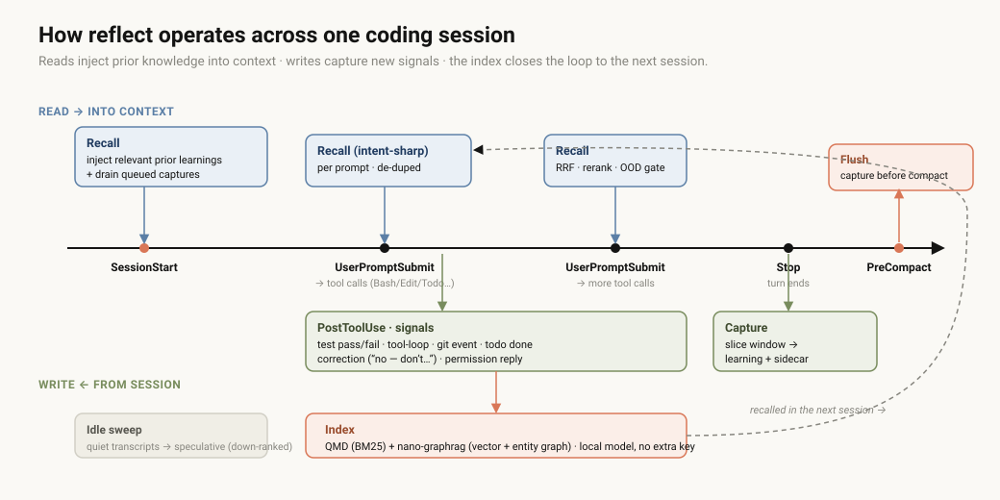
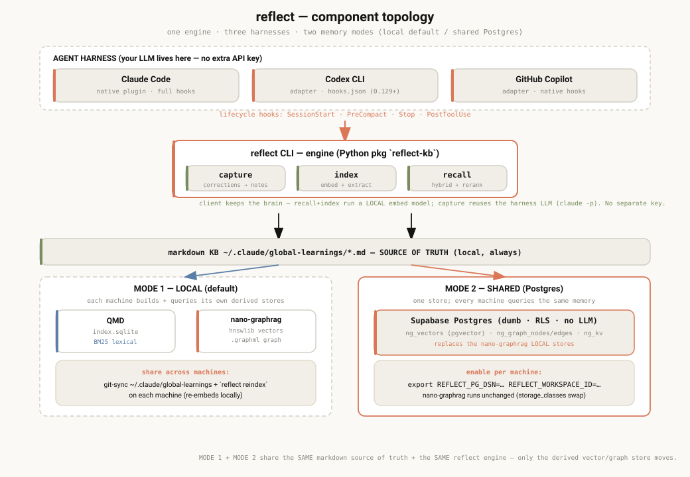

> Eight coding-agent memory systems, four deciding axes, and an honest build-vs-adopt verdict. The
> short version: the tools that need no second API key tend to hoard noise; the ones that curate well
> make you run a server and pay a second provider; and none capture corrections, tests, git events or
> skill upgrades as typed signals. reflect is the row that holds all four.

:::tip[Interactive version]
A richer, standalone version of this page (option cards, scored matrix, the full critique) is published at
**[explainers.stevengonsalvez.com/agent-memory-landscape](https://explainers.stevengonsalvez.com/agent-memory-landscape/)**.
For the newcomer framing see [Problem & fit](/knowledge/reflect-memory/problem-and-fit/).
:::

## The problem: context engineering, not a bigger file

Every coding harness gives you one persistent-memory primitive: a static instructions file you
maintain by hand (`CLAUDE.md`, `AGENTS.md`, `MEMORY.md`), front-loaded into the context window every
session. The window is finite and **shared with the task** — every line you front-load "just in case"
is bloat the moment this session doesn't need it. The real problem is **retrieval**: store the
signal-bearing moments and query the right one at the right time. That's why a class of "agent memory"
products exists. This page compares them and explains why we built rather than adopted.

## The four deciding axes

1. **Store everything vs selectively** — whole-session / fire-hose capture is useful but accretes
   noise and unbounded data over time.
2. **Separate LLM/embedding key** — your coding agent already has a model + subscription; most memory
   tools make you configure and pay for a *second* provider just for memory.
3. **Infrastructure** — an always-on server (Postgres, Redis, a Rust/Bun daemon, a vector DB) is
   operational weight, and often cloud-bound.
4. **First-class coding-signal capture** — corrections, test outcomes, git events, skill upgrades
   captured *structurally*, or only as prose an LLM might (or might not) extract?

## The eight systems

| Tool | What it stores | Extra LLM/embed key? | Runs as | First-class coding signals | License |
|---|---|---|---|---|---|
| **reflect** | **selective** learnings; markdown = source of truth | **No** — reuses the agent's own model + local embeddings | **local files** (sqlite + graphml); optional shared Postgres | **Yes** — corrections, tests, tool-loops, git, todos, permissions, contradictions, skill-refresh | MIT |
| [Hindsight](https://github.com/vectorize-io/hindsight) | LLM-extracted facts + mental models | Yes for writes¹ | local daemon → Docker (FastAPI+Postgres) → cloud | No — extracted from prose; skill capture is a logged bug | MIT |
| [Mem0](https://github.com/mem0ai/mem0) | LLM-extracted facts | **Yes** — OpenAI by default at ingest | library → Docker (Postgres+Neo4j); graph = Pro $249/mo | No — hooks, but no correction/git/test capture | Apache-2.0 + SaaS |
| [ByteRover](https://github.com/campfirein/byterover-cli) | curated markdown tree | curation makes its own LLM calls | local files + node daemon; optional cloud sync | No — curation is agent-*directed*, not passive | Elastic 2.0 (not OSS) |
| [claude-mem](https://github.com/thedotmack/claude-mem) | every tool call → compressed observations | **No** — reuses Claude auth + local embeddings | always-on Bun daemon + optional ChromaDB | No — probabilistic Haiku extraction | Apache-2.0 |
| [agentmemory](https://github.com/rohitg00/agentmemory) | **fire-hose** — every tool call, verbatim | optional (value degrades without it) | always-on Rust daemon (4 ports) | No — raw events; little structure without LLM | Apache-2.0 |
| [Honcho](https://github.com/plastic-labs/honcho) | user/peer models (theory-of-mind) | Yes (self-host); cloud is per-token | Postgres + Redis + deriver worker; or cloud | No — built for end-user personalization, not coding | AGPL-3.0 |
| [OpenViking](https://github.com/volcengine/OpenViking) | LLM-extracted memories/skills (tiered) | **Yes** — OpenAI/Volcengine by default | Rust+Go+C++ server, always-on | No — git/test/skill not first-class | AGPL-3.0 |

¹ Hindsight's `retain` needs an LLM; its "reuse your Claude subscription" loopback is documented as
**personal-use-only per Anthropic's terms** — not shippable as a default.

The pattern: the only other system that matches reflect on *no extra key* (claude-mem) collapses on
*selective/noise*; the systems that curate well (Hindsight, OpenViking, ByteRover) lose on *no extra
key* or *local-first*; and **first-class signal capture is a wall of "no"** — nobody else treats
corrections, tests, git or skills as typed events.

## How reflect works

## Token economics — both sides of the ledger

Memory looks cheap if you only price retrieval. The real cost is the **write side** (LLM
extraction/consolidation) plus the **read side** (context injection).

| System | Write side | Read side | Net extra spend |
|---|---|---|---|
| **reflect** | reuses harness LLM (`claude -p`), gated + queued; local embed | local — vector + BM25 + graph, no LLM | **$0 extra** (rides your existing sub) |
| claude-mem | Haiku on your Claude auth, per tool-call batch | FTS5 + local ONNX vectors | $0 extra, but high write volume |
| Hindsight | `retain` = LLM extraction; cloud $15/M tokens | vector/graph; `reflect` synthesis costs | separate key or $15/M retain |
| Mem0 | OpenAI extraction at ingest | vector/BM25; graph = Pro $249/mo | separate OpenAI key + tier |
| OpenViking | VLM extraction + L0/L1 summaries | vector recursive (no LLM) | separate provider key |
| Honcho | deriver LLM ("dreaming") per batch | `context()` free; dialectic up to $0.50/query | 1–3 keys (self-host) or per-query |
| agentmemory | optional LLM compression (off by default) | local embed; triple-stream RRF | $0 if LLM off — value degrades |
| ByteRover | curation = own LLM calls | BM25 → LLM fallback | own key tokens or Pro $19/mo |

:::caution[Dangerous default to watch]
**Auto-retain every turn + large auto-recall** is how memory tools quietly burn a subscription —
agentmemory has documented incidents of exhausting a Claude Pro quota in a handful of messages.
reflect's capture is **gated and queued** (not every turn), and recall is **OOD-gated +
token-budgeted** — it injects nothing when nothing fits.
:::

## Observability & correction

When the memory is wrong, can you see it, edit it, delete it, and trace where it came from?

- **reflect** — learnings are plain markdown you open, edit or delete in your editor; volatile signals
  live in a DB sidecar (clean git diffs); each learning links back to its source transcript + chunk;
  per-row TTL + contradiction handling expire stale beliefs.
- **Most others** — facts live in Postgres + vector DBs, inspected via API or SQL, not your editor.
  claude-mem ships a web viewer but observations are DB rows; ByteRover is the exception (an editable
  markdown tree). Correcting a wrong memory usually means an API call or a re-curation pass, not a
  one-line file edit + commit.

## Self-improvement — how a correction becomes behaviour

This is the wedge. In every other system a correction is, at best, a sentence in a transcript an
extraction LLM *might* turn into a fact — Hindsight literally files capturing a skill update as a
*bug*. reflect routes it as **typed signals** at hook time (`SG1`–`SG8`: contradiction, git
commit/revert, test pass/fail, tool-loop, permission reply, idle sweep, negative-recall gaps) and
**auto-refreshes the skills those learnings affect** (`R13`/`R14`). A correction isn't hoping to be
extracted from prose; it's a structured event that can revise a belief or promote a skill.

> Everyone else remembers **what was said**. reflect captures **what changed** — and turns it into the
> next session's behaviour.

## Recommendation & decision rule

:::note[Decision rule]
Adopt an external memory provider **only if** it (a) needs no second API key or subscription, (b) runs
without a mandatory always-on server, and (c) captures coding signals as typed events. **No single
external tool clears all three.** So: build the thin, differentiated layer (capture + typed signals +
local-first), and **port — don't re-invent forever — the commodity retrieval**, keeping it behind a
seam so a stronger backend can be swapped in later.
:::

**Verdict: build + port, with eyes open.** reflect ported Hindsight's retrieval ideas
(graph-expansion arm, RRF fusion, cross-encoder rerank, temporal arm) across a
[57-port effort](/knowledge/reflect-memory/recall/) — so it has the retrieval brains without the
infra/LLM/ToS baggage, at the cost of owning that code.

:::caution[Honest sensitivity note]
These weights favour self-improvement and zero-friction operation — reflect's strengths. Re-weight
toward **pure retrieval quality and ecosystem maturity** and **Hindsight wins**: MIT, production-grade,
94.6% LongMemEval, ~48 integrations, 62 releases. If your priority is "best recall, least code I
maintain," adopting Hindsight (as a retrieval backend) is the smarter call. The build case rests on
valuing *no-extra-key capture* and *typed signals* — which is why retrieval is kept swappable, not
sacred.
:::

## If you'd adopt instead — four pilot acceptance tests

1. **Zero extra credentials** — install on a fresh machine with only the coding agent's existing auth.
   Does capture + recall work with no new key or account? *(reflect / claude-mem: pass · most: fail)*
2. **No always-on server** — reboot. Does memory work with nothing running in the background?
   *(reflect: pass · daemon-based tools: fail)*
3. **Correction → behaviour** — correct the agent once; next session, does the rule resurface
   *without* manual curation? *(the typed-signal test — reflect's wedge)*
4. **Noise over 30 days** — run daily for a month. Is recall still sharp, or flooded with stale /
   duplicate / fire-hosed entries? *(fire-hose tools degrade here)*
