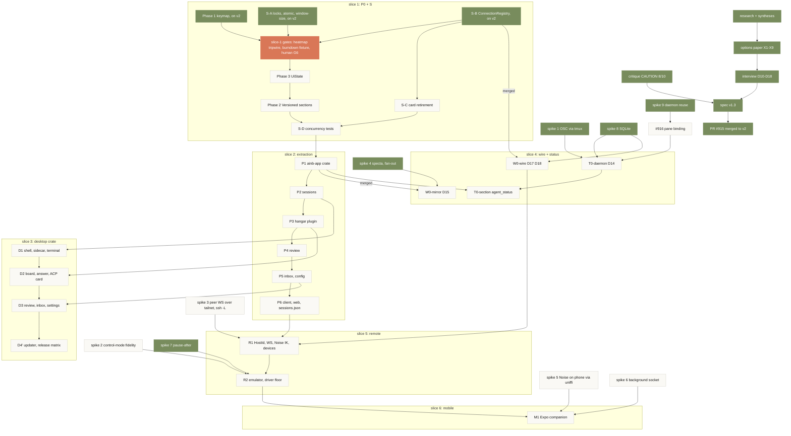

# Desktop programme: one DAG over both specs

**Date:** 2026-09-12
**Role:** execution view. The two specs are locked decision records; this doc is the single place that says what runs, in what order, behind which gate, and what is done. Edit it in the same PR that flips a node.
**Wraps:** `2026-09-04-desktop-shared-core-spec.md` (D1-D9, phases P0-P6, S, D1-D4) and `2026-09-11-multi-surface-decisions-spec.md` (D10-D18, phases W0, T0, R1, R2, M1).
**Integration branch:** `v2`. Every node lands as a PR to `v2`; `v2` merges to `main` as a whole at an agreed cut. `main` keeps moving (10 commits since the cut on 2026-09-11); `v2` takes `main` back by merge before each slice starts.
**Grounding:** node states below were read from `git` and `gh` on 2026-09-12 against `v2` at `54266dcd` (96 commits of slice-1 work replayed from `anthias` and pushed directly, plus the P0 handoff `2026-09-12-p0-surface-safety-handoff.md`); re-ground before trusting.

## The DAG



Same DAG, terminal view:

```
 research ─▶ options ─▶ interview ─▶ spec v1.3 ─▶ PR #915 → v2          [done]
                                    ▲ critique

 slice 1  P0+S
          wave1: Phase 1 keymap ✓ · S-A ✓ · S-B ✓  (on v2, 96 commits)
          gates open: heatmap tripwire ✗ · burndown fixture findings · human G6 checkpoint
          wave2: Phase 3 UiState · S-C            wave3: Phase 2 Versioned    wave4: S-D
              │ S-B on v2 (met)                     │ S-D merged
              ▼                                     ▼
 slice 4  W0-wire (D17 D18) ◀── spike 8 ✓      slice 2  P1 ─▶ P2 ─▶ P3 ─▶ P4 ─▶ P5 ─▶ P6
          T0-daemon (D14) ◀── spikes 1 8 9 ✓, #916     │ P1 merged        │      │
              │                                        ▼                  │      │
              │                              W0-mirror (D15) ◀── spike 4 ✓ │      │
              │                              T0-section  ◀── T0-daemon    │      │
              │                                                           │      │
 slice 3      │                        D1 ◀── P2   D2 ◀── P3   D3 ◀── P5  ◀──────┘      │
              │                        D4' updater + release matrix                     │
              ▼                                                                         ▼
 slice 5  R1 hosts + WS  ◀── W0-wire, P6, spike 3  ─▶  R2 emulator + floor ◀── spike 2, spike 7 ✓
                                                             │
 slice 6                                              M1 mobile ◀── spikes 5, 6
```

## Node status (grounded 2026-09-12)

| node | slice | state | gate to start | gate to finish | evidence |
|---|---|---|---|---|---|
| research, syntheses, critique, options paper, interview, spec v1.3 | 0 | **done** | | | PR #915 merged to `v2` at `1fdf399c` |
| P0 status explainer | 1 | done | | | `explainers/ainb-p0-surface-safety.html` on `v2` |
| spikes 1, 4, 7, 8, 9 | 0 | **done** | | | `research/2026-09-11_multi-surface_SPIKE-{1,4,7,8,9}-*.md` on `v2` |
| Phase 1 keymap (wave 1) | 1 | **done on v2** | | keymap table, TOML overrides, `keyboard-shortcuts.md` regenerated, CI freshness gate | `keymap.rs`, `keymap_toml.rs`, `tests/keymap_parity.rs`, `ci: verify keymap docs freshness` on `v2` |
| S-A locks, atomic writes, window-size (wave 1) | 1 | **done on v2** | | concurrent-save test, headroom proxy lock | `config/lock.rs`, `tests/config_concurrent_save.rs` on `v2` |
| S-B ConnectionRegistry (wave 1) | 1 | **done on v2** | | hello extension, `hangar/connections_list`, presence lifecycle, ACP provenance | `proto/connections.rs`, `rpc/connections.rs`, `feat(hangar): list live connections` on `v2` |
| slice-1 open gates | 1 | **blocked** | | core suite green, fixture findings fixed, human G6 two-terminal check, `v2` CI green | handoff: `tripwire_burndown_heatmap` fails after `Left`; burndown Esc fixture P1/P2 findings; G6 pending. CI on `v2` head `54266dcd`: `Test ainb installations` fails in `browse_modal_searches_and_enter_installs_live` (passes on `main`); `Build site` fails because `ainb keymap list --format md` writes `docs/tui/keyboard-shortcuts.md` without the Starlight `title` frontmatter (`InvalidContentEntryDataError`) |
| Phase 3 UiState, S-C (wave 2) | 1 | **not started** | slice-1 gates | human-verify checkpoint: scroll and mouse | `ui_state.rs`, `tests/ui_state.rs` absent on `v2`; plan `:442,319` |
| Phase 2 Versioned sections (wave 3) | 1 | not started | Phase 3 | 19 sections, `SectionVersions` | `versioned.rs`, `sections.rs` absent on `v2`; plan `:350` |
| S-D concurrency tests (wave 4) | 1 | not started | S-A, S-B, S-C, Phase 2 | answer race, resize during answer, surface combo | `tests/answer_race.rs`, `surface-combo-smoke.sh` absent on `v2`; plan `:510` |
| P1 `ainb-app` extraction | 2 | planned | slice 1 merged | `cargo test -p ainb-app` runs the moved tests; tripwires green | base spec P1 |
| P2-P5 screens | 2 | planned | P1 | per-screen tripwires green | base spec |
| P6 client reconnect, web onto client, sessions.json to daemon | 2 | planned | P5 | web e2e green; TUI + web + CLI concurrent smoke | base spec |
| W0-wire: `PROTOCOL_VERSION` in hello, capability catalogue, skew harness, op-id ledger, receipts | 4 | **ready to start** | S-B on `v2` (met 2026-09-12); coordinate `rpc/mod.rs` with nothing, S-C and S-D do not touch it | `MUTATING_METHODS` test, replay twice = one `created` one `replayed`, skew harness both ways | spec v1.3 W0-wire |
| #916 pane binding without launcher env | 4 | planned | none | `env -i` hook test, no duplicate legacy row | issue open |
| T0-daemon: status store on `fleet_session`, one txn per event, retention, normalizers, OSC schema | 4 | planned | spike 1 (done), #916 | identical tuples across CLI, web, TUI; silence never `done` | spec v1.3 T0-daemon |
| W0-mirror: per-drain apply, scalar selectors, subscription filter, specta feature | 4 | planned | **P1 merged** | bench ceiling 12,800 runs, 32.5 ms per 1,000 frames, units = 125 | spec v1.3 W0-mirror |
| T0-section: `agent_status` as section 20 | 4 | planned | P1, T0-daemon | fleet panel renders from the section | spec v1.3 |
| D1 shell, sidecar, WS terminal, sidebar, palette | 3 | planned | P2 | wdio sessions journey | base spec D1 |
| D2 board, attention, answer, ACP card | 3 | planned | P3 | wdio answer journey | base spec D2 |
| D3 review, inbox, settings, burndown, fallback cell | 3 | planned | P5 | full parity suite | base spec D3 |
| D4' updater, release matrix (host switcher moved to R1) | 3 | planned | D3 | release-branch human-driver run | spec v1.3 amendment 26 |
| spike 3 peer WS + Noise over tailnet and `ssh -L` | 5 | planned | none | 50 MB in 2 s both carriers; daemon survives desktop close | spec v1.3 spikes |
| R1 HostId, WS listener, Noise IK, single-use invite, device registry, scopes, census, host switcher | 5 | planned | W0-wire, P6, spike 3 | two boxes in one UI; kill client mid-turn and resync; revoke closes socket 4403 | spec v1.3 R1 |
| spike 2 control-mode emulator fidelity | 5 | planned | none | snapshot byte-equal after ANSI normalisation | spec v1.3 spikes |
| R2 emulator, snapshot, per-viewer flow control, driver floor | 5 | planned | R1, spike 2 | 40x20 phone frame; two typists no interleave; resize count at most 2 | spec v1.3 R2 |
| spikes 5, 6 phone crypto via uniffi, background socket lifetime | 6 | planned | none | | spec v1.3 spikes |
| M1 Expo companion, interactive terminal behind `mobile+type` | 6 | planned | R2, W0-wire, spikes 5, 6 | answer a banner in two taps, foreground | spec v1.3 M1 |
| v2 → main | | planned | agreed cut, at latest M1 | | |

## Plan slices and their `/plan` inputs

| slice | nodes | plan file | state |
|---|---|---|---|
| 1 | Phase 1, S-A, S-B, Phase 3, S-C, Phase 2, S-D | `2026-09-05-desktop-p0-surface-safety.md`; resume point `2026-09-12-p0-surface-safety-handoff.md` | wave 1 on `v2`; gates open; waves 2-4 not started |
| 2 | P1-P6 | not written; `/plan` from the base spec after slice 1 merges | |
| 3 | D1-D3, D4' | not written; `/plan` from the base spec plus D11 after P2 | |
| 4 | W0-wire, #916, T0-daemon, then W0-mirror, T0-section | not written; `/plan` from spec v1.3 after S-B merges | |
| 5 | spike 3, R1, spike 2, R2 | not written; after W0-wire and P6 | |
| 6 | spikes 5 and 6, M1 | not written; after R2 | |

## What can start now, independent of slice 1

| item | why it is free | cost |
|---|---|---|
| **W0-wire** | its only gate, S-B, is on `v2`; edits `HelloParams`, `rpc/mod.rs`, `answer.rs`, `hangar-client`, none of which slice-1 waves 2-4 touch | 1-2 weeks |
| slice-1 gate repair (heatmap tripwire, burndown fixture) | named in the handoff's First Resume Work; blocks waves 2-4 | days |
| #916 pane binding | daemon-only, touches `fleet.rs`, `rpc/mod.rs`, `atc.rs`, none of which slice 1 edits except `rpc/mod.rs` (S-B); coordinate that one file | days |
| spike 3 | scratch prototype, no repo edits | 2-3 days |
| spike 2 | scratch prototype, picks the VT emulator crate | 2-3 days |
| spikes 5, 6 | phone scratch project | 3 days |
| `v2` takes `main` | merge, not rebase; keeps the 12 docs commits as they are | minutes |

## Rules of the road

- Base every PR on `v2`. A PR against `main` for this programme is a mistake; retarget it. Slice-1 wave 1 landed by direct push (a replay from `anthias`); from here every node lands by PR so its gate is visible in CI.
- The P0 handoff's line "do not start P1-P6 or D1-D4" scopes that worker, not the programme: W0-wire, #916 and the spikes are free now per the table above.
- A node flips to done only when its finish gate is green in CI on `v2`, and this table is edited in the same PR.
- Locked decisions D1-D18 are not re-opened by a node PR. A node that needs a decision change opens a spec amendment PR first.
- Spikes write to `research/` (force-add) and never to crates.
- Never two nodes editing `HelloParams`, `rpc/mod.rs`, or `state.rs` at once: S-B before W0-wire, P1 before W0-mirror and T0-section.
