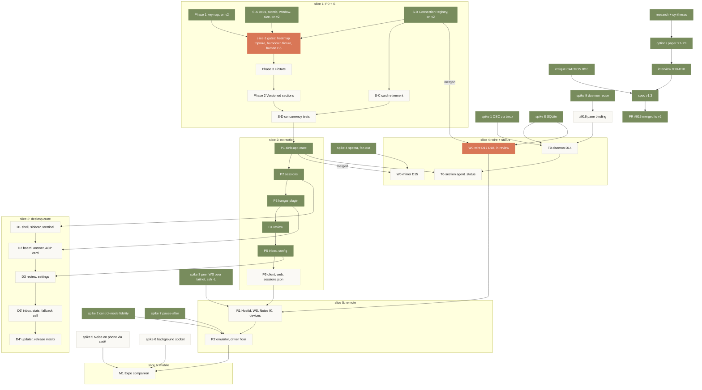

# Desktop programme: one DAG over both specs

**Date:** 2026-09-12
**Role:** execution view. The two specs are locked decision records; this doc is the single place that says what runs, in what order, behind which gate, and what is done. Edit it in the same PR that flips a node.
**Wraps:** `2026-09-04-desktop-shared-core-spec.md` (D1-D9, phases P0-P6, S, D1-D4) and `2026-09-11-multi-surface-decisions-spec.md` (D10-D18, phases W0, T0, R1, R2, M1).
**Integration branch:** `v2`. Every node lands as a PR to `v2`; `v2` merges to `main` as a whole at an agreed cut. `main` keeps moving (10 commits since the cut on 2026-09-11); `v2` takes `main` back by merge before each slice starts.
**Grounding:** node states below were read from `git` and `gh` on 2026-09-12 against `v2` at `d57527f4` (slice-1 wave 1 replayed from `anthias`, the P0 handoff, `main` merged in by PR #926, lane goal prompts under `docs/plans/goals/`); re-ground before trusting.

## The DAG



Same DAG, terminal view:

```
 research ─▶ options ─▶ interview ─▶ spec v1.3 ─▶ PR #915 → v2          [done]
                                    ▲ critique

 slice 1  P0+S
          wave1: Phase 1 keymap ✓ · S-A ✓ · S-B ✓  (on v2, 96 commits)
          gates open: heatmap tripwire ✗ · burndown fixture findings · human G6 checkpoint
          wave2: Phase 3 UiState · S-C            wave3: Phase 2 Versioned    wave4: S-D
              │ S-B on v2 (met)                     │ S-D merged
              ▼                                     ▼
 slice 4  W0-wire (D17 D18) ◀── spike 8 ✓      slice 2  P1 ─▶ P2 ─▶ P3 ─▶ P4 ─▶ P5 ─▶ P6
          T0-daemon (D14) ◀── spikes 1 8 9 ✓, #916     │ P1 merged        │      │
              │                                        ▼                  │      │
              │                              W0-mirror (D15) ◀── spike 4 ✓ │      │
              │                              T0-section  ◀── T0-daemon    │      │
              │                                                           │      │
 slice 3      │                        D1 ◀── P2   D2 ◀── P3   D3 ◀── P5  ◀──────┘      │
              │                        D3' inbox + stats + fallback cell ◀── D3         │
              │                        D4' updater + release matrix                     │
              ▼                                                                         ▼
 slice 5  R1 hosts + WS  ◀── W0-wire, P6, spike 3 ✓ ─▶  R2 emulator + floor ◀── spikes 2 ✓, 7 ✓
                                                             │
 slice 6                                              M1 mobile ◀── spikes 5, 6
```

## Node status (grounded 2026-09-12)

| node | slice | state | gate to start | gate to finish | evidence |
|---|---|---|---|---|---|
| research, syntheses, critique, options paper, interview, spec v1.3 | 0 | **done** | | | PR #915 merged to `v2` at `1fdf399c` |
| P0 status explainer | 1 | done | | | `explainers/ainb-p0-surface-safety.html` on `v2` |
| spikes 1, 4, 7, 8, 9 | 0 | **done** | | | `research/2026-09-11_multi-surface_SPIKE-{1,4,7,8,9}-*.md` on `v2` |
| Phase 1 keymap (wave 1) | 1 | **done on v2** | | keymap table, TOML overrides, `keyboard-shortcuts.md` regenerated, CI freshness gate | `keymap.rs`, `keymap_toml.rs`, `tests/keymap_parity.rs`, `ci: verify keymap docs freshness` on `v2` |
| S-A locks, atomic writes, window-size (wave 1) | 1 | **done on v2** | | concurrent-save test, headroom proxy lock | `config/lock.rs`, `tests/config_concurrent_save.rs` on `v2` |
| S-B ConnectionRegistry (wave 1) | 1 | **done on v2** | | hello extension, `hangar/connections_list`, presence lifecycle, ACP provenance | `proto/connections.rs`, `rpc/connections.rs`, `feat(hangar): list live connections` on `v2` |
| slice-1 open gates | 1 | **done on v2**, G6 steps 1 to 7 run 2026-09-13 on v2 at 026f4082 (lane H, PR #985): steps 1 to 3, 6, 7 pass, step 4 and 5 fail on regressions #987, #988, #989, plus #990, #991; fixes on lane I; steps 8 to 10 still Stevie's | | core suite green, fixture findings fixed, human G6 two-terminal check, `v2` CI green | PR #933 closed the CI gates (`Build site`, `Test ainb installations`, the heatmap tripwire on a strengthened assertion). The three daemon reds this lane carried from wave 2 cleared when #934 landed, and S-D's merged head is fully green on both OS legs: 26 pass, 1 skip, 0 fail. G6 is handed to Stevie with all ten steps, re-verified against `v2` at `4cbab0970`; his reply is the one remaining human item in slice 1 |
| Phase 3 UiState (wave 2) | 1 | **done on v2** (PR #945, 2026-09-12) | slice-1 gates | human-verify checkpoint: scroll and mouse, on the G6 page as steps 8 to 10 | `ui_state.rs`, `tests/ui_state.rs`; draw path sealed on `&AppState` behind a renderer-local `UiState`, scroll AppEvents replaced by `UiAction::Scroll(ScrollAction)` |
| S-C card retirement (wave 2) | 1 | **done on v2** | S-B on `v2` (met) | `AttentionAnswered` folds in the TUI and the web form closes on `already_answered` | PR #936: `ControlCenterState::retire_answered` plus the wire-level fold test in `plugin.rs`, `app.js` retires the card's controls; copilot already sends `answered_by` and the daemon stamps the host (S-B 3b); merged at `ba1590cc` (PR #936); plan `:319` |
| Phase 2 Versioned sections (wave 3) | 1 | **done on v2** (PR #956, 2026-09-13) | Phase 3 (met) | 19 sections, `SectionVersions` | `versioned.rs`, `sections.rs`; `versions()` derived from `SectionId::ALL`, every section moves only its own slot, draw path compare-then-set, daemon publishes bump Fleet through a generation counter |
| S-D concurrency tests (wave 4) | 1 | **done on v2** (PR #964, 2026-09-13) | S-A, S-B, S-C, Phase 2 (met) | answer race, resize during answer, surface combo | `tests/answer_race.rs` asserts one `AttentionAnswered`; `tripwire_multi_attach_resize.rs` on a private tmux server, named in CI on both platforms; `scripts/surface-combo-smoke.sh` runs four combinations on both platforms and fails closed; four macOS-only tripwire deaths gated to Linux under #966 |
| P1 `ainb-app` extraction | 2 | **done on v2** (P1a #973, P1b #975, P1c #982 at b725a95c, 2026-09-13) | slice 1 merged | `cargo test -p ainb-app` runs the moved tests (281 moved, 16 stay); tripwires green; `renderer_free` guard proves no ratatui or crossterm in the crate | inventory `docs/plans/2026-09-13-p1-extraction-inventory.md`; `Intent`, `Chord`, `dispatch`, `CommandId` registry (chord optional), `RendererHost` seam; `AppEvent` stays public until P2 makes pointer return an Intent; no `Serialize` on state (#983) |
| P2-P5 effects and hosts | 2 | **P2 to P5 done on v2** (P2 #1000 at c599ebd7, P3 #1008 at 36e84831, P4 #1021 at b30a81c6, 2026-09-14, four reviews each; P5a #1043 at ddb4ef6d, P5b #1057 at 28e6bf7d, P5c #1061 at a023f7d1, P5d #1065 at eace2637f, 2026-09-15, four reviews plus a fix verification each); P5d landed the command gate cut at the topmost overlay and the per-test tripwire ratchet (filter, skip-set guard, excluded-set workflow) and closed #1035; slice 2 is done; D1 depended on #1045 (done, #1083), the overlay classification (done, #1065) and #1077 (#1094 in review); #1046 and #1062 are parallel | P1 (met) | per-screen tripwires green; every side effect an `Effect` the host executes; parity fixtures per screen | goal `docs/plans/goals/2026-09-13-p2-p5-effects-and-hosts.md`; P2: `Effect` outbox with attach, detach, editor, OAuth login and clipboard paste, pointer returns an `Intent`, `AppEvent` crate-private (`test-support`), `Args` honoured, `host::TERMINAL` and `RendererHost::columns` gone, side-effect guards in `ainb-app/tests/host_side_effects.rs`; P5 carries two named limits: #1045 (plugin forwarding as an effect, runtime handle out of `AppState`, before D1) and #1046 (`watch_screen` lease keyed by `(host_id, screen)`, after W0-mirror #1036) |
| P6 client reconnect, web onto client, sessions.json to daemon | 2 | **P6a, P6b done on v2** as #1166 (reconnect with 1s/4s/16s backoff, resync on hello, the reconnecting state drawn by every surface, web e2e gated in CI; 13 review fixes and four CI rounds); **P6c done on v2** as #1174 (the web dashboard on the shared client), test follow-ups #1198 and #1207; **P6d in review** as #1206: the sessions table, typed repo, workspace session RPCs, a marked one-time import and boundary validation, landing DARK (the capability is defined and not advertised, every reader and writer behaves as before, the daemon shadow-writes the table) after review found a mirror write that could erase `sessions.json` and TUI-created sessions vanishing from `ainb list`; **P6e planned**, goal #1210: TUI readers and writers plus the CLI on one source, a repeatable reconcile, a kill switch, the `p6-concurrent` proof before the capability flip; goal `docs/plans/goals/2026-09-16-p6-client-web.md` | P5 | web e2e green; TUI + web + CLI concurrent smoke (P6e) | base spec |
| W0-wire: `PROTOCOL_VERSION` in hello, capability catalogue, skew harness, op-id ledger, receipts | 4 | **done on v2** (PR #935, 2026-09-12, 40 commits, three review rounds incl. a second-family and a security pass) | S-B on `v2` (met) | hello carries `protocol {min,max}` + catalogue with a removal-fails test; skew harness N and N-1 x 3 clients green in the Contracts job; ledger keyed `UNIQUE(host_id, op_id)` with concurrent-claim test; receipts in the flip transaction; boot sweep keeps `delivered`/`failed`; per-principal ceiling; alias verified before dial | follow-ups for the status lane: `fleet/action` and `fleet/message_send` fences are `FenceKind::None` until their executor is fenced |
| #916 pane binding without launcher env | 4 | **done on v2** (PR #934, 2026-09-13) | none | `env -i` hook test, no duplicate legacy row | `pane_binding.rs` 1/0/2 binding, candidate query excludes hook rows, migration 0098 repairs frozen tier-5 authority; fingerprint invalidation deferred to #961 |
| T0-daemon: status store on `fleet_session`, one txn per event, retention, normalizers, OSC schema | 4 | **done on v2** (PR #934 at c79e1aca, follow-up PR #967 at 45b41a2d, flake fixes PR #978 at 89aa30d5 closing #953 and #958, 2026-09-13) | spike 1 (done), #916 (done), 0097 (met) | identical tuples across CLI, web, TUI; silence never `done` | apply transaction with attention projection, retention, rollback flag, normalizer, `fleet/status` capability; migration 0099 stores tier, clocks and `session_incarnation`, the fence orders on `session_started`, restart closes the old run's cards, the pane binding is written once and invalidated on fingerprint mismatch. Remaining: #962 (panel on `fleet/status`, TestBackend gate, supersede in the apply txn), parked until P1 lands |
| T0-section: `agent_status` as section 20 | 4 | **done on v2** (PR #1019 at f69e3655, 2026-09-14, three reviews, #1015 closed); single owner **done on v2** as PR #1038 at 04554585 (lane C, #1031 closed, three reviews plus a fix verification) | P1, T0-daemon (met with follow-ups), #962 (merged as #1014) | a surface renders the Fleet panel from section 20 alone: met in the gate (TestBackend, section-only panel paints the plugin's cells); met in production with #1031: the TUI Fleet panel renders the envelope the section 20 host task publishes on `fleet.agent_status`, and the plugin holds no Fleet read | one joined daemon read `fleet/roster_status` (capability `fleet.roster_status.read`) costs 1 projection per read; criterion 9 met per process with #1031: at most 1 whole-Fleet projection per event (2 with `legacy_panel` or an N-1 daemon), asserted with `projection_reads` in `ainb-core/tests/agent_status_host.rs`; the host task picks the read path once per connection from the advertised capability, so an N-1 daemon gets the two reads (rows with states, no answer or approval actions) and the plugin never sees a method-not-found; section 20 folds through the shared proto `StatusView`; card words are `AgentState::as_str()` or row fields, no DONE; absent, stale and unreachable render in the lens body; `[fleet.status] legacy_panel` rollback honoured in v1.29.0 (assumed at the v2 cut) and removed with the pre-section read in v1.30.0 |
| W0-mirror per-drain apply, scalar selectors, subscription filter, specta feature | 4 | **done on v2** as PR #1036 at 4ff111b2 (lane K, goal `2026-09-14-w0-mirror.md`, 2026-09-15, four reviews plus an eleven-item fix verification: boot epoch, peer-checked host id, eviction, MAX_FRAME_BYTES, envelope in the key-path fixture; follow-ups #1066, #1067, #1068, #1052, #1056); #983 merged as PR #1026, #1032 residuals closed in #1036; host-only field split handed to lane F P5 (#1036 comment) | **P1 merged**, **#983 met**, T0-section #1019 merged | frames only through `wire::serialize_section`: `Mirror` frames changed and subscribed sections with version, `host_id` and the daemon read; `MirrorStore` applies one transaction per drain, runs effects after commit, keys sections by host and exposes `Scalar`-only root selectors (`ainb-core/tests/mirror_renderer.rs`: subset, unsubscribed hot section, two-host fold, 90 s skew). `tests/serialize_guard.rs` fails on `Serialize` for `AppState` or any section, and on any new serialisation call site. Card ages use the daemon clock, which the agent-status envelope carries too (`daemon_clock_ms`). Section 20 and Fleet rows carry no `cwd`, `current_request` or `display_name`. Fan-out bench in CI: per-drain 9,885 runs, 19.44 ms per 1,000 frames (median), 125 units, per-send fails both gates (run 34889098650 at 76256fd90, job 104127411634). `typescript-bindings` builds across the type closure; `ainb-app/bindings/AppState.ts` is regenerated, diffed and type-checked against real sample frames in CI (run 34889098650, job 104127411764) | spec v1.5 W0-mirror; sweep on PR #982; seam and checks in #1026; contract, bench and bindings in #1036 |
| D1 shell, sidecar, terminal tab, sidebar, palette | 3 | **D1a done on v2** as #1116 at 6fd991ea4 (2026-09-15, four reviews, seven fixes plus a flock-owner guard verified): `ainb-tui/crates/ainb-desktop` as an excluded workspace, the embedded `ainb-app` host with the frame pump, the effect executor, the bundled daemon sidecar supervisor with presence, the xtask stage step, the desktop CI job; spec amendment #1111 (no local WS listener); **D1b done on v2** as #1130 at e80066f98 (2026-09-15, four reviews, sixteen fixes verified): the Solid frame store keyed (host id, section) under per-host epochs with the transport peer as the key, a 64-host cap and host-keyed staleness, the sessions sidebar with attention rings by provider session id, header counts, the attention poller started from the host tick, the RendererIntent subset with host-report ids and key-only rows refused at the webview seam, one subscription list owned by the webview; **D1c done on v2** as #1137 at 909be1c69 (2026-09-15, four reviews, 27 fixes verified): the Rust-owned PTY attaching tmux, raw bytes to xterm.js over a Tauri channel with a 4 MiB credit window acked after paint, 8 tabs per host with the tab in view never evicted, redials then a reattach through the reducer, eviction and redial reporting attach_finished, resize clamped and input bounded, the startup move to session_list through reducer rows; **merged** #1140 and #1143 (#1131: merged attention on the Sessions frame, the desktop rings from it); **D1d in review** as #1154 (palette over commands and live sessions from one refusal set, copy and paste, the wdio journey behind the `wdio` cargo feature with the macOS leg on its recorded substitute, the bundle smoke asserting no WebDriver symbol and no listener of the window's own, the `d1-shell` proof scenario passing 1 of 1, a workspace rescan on a cadence that writes nothing when the scan found nothing, the sidebar honouring the session filter); Desktop workflow run 35137646453 at e5ebcb3ea; carries filed as #1155 to #1162; **D1d merged** as #1154 at ccfa4afd2 (2026-09-17, code, security, Codex and two verifications, 24 items fixed before merge); **D1 done on v2**; goal `docs/plans/goals/2026-09-15-d1-desktop-shell.md` | P2 | wdio sessions journey | base spec D1 |
| D2 board, attention, answer, ACP card | 3 | **done on v2** 2026-09-19 at 9342a492a: D2·spec #1170, D2a #1173 (the reducer tick step, surface-aware answers, the frame fields, generated RendererIntent and PaletteEntry bindings), D2b #1177 (the board, attention list, board landing tab), D2c #1182 (the answer banner on the reducer's own chip, `ask.clear`, bounded typed text, a pick's sequence that stops at the first refused intent), D2d #1186 (the ACP card over the daemon transcript), D2e #1190 (the wdio answer journey, the `d2-board` proof, the desktop agent status feed, hook-raised ASK chips carrying their question and options capped at the parse boundary, #1160 closed by refusal). Each PR took code, security, design and adversarial verification passes; the merge-downs were verified separately. v2 stopped compiling once on the way (#1167 plus #1173, hotfix #1189), which set the rule that a PR merges only after it is checked against the current tip. The board card for a Claude question stays waiting until #1049. Follow-ups: #1188 (one agent status reader, lane C), #1191 (pick by label in one intent), #1192, #1193, #1194, #1208; goal `docs/plans/goals/2026-09-16-d2-desktop-board.md` | P3 | wdio answer journey, green on #1190 | base spec D2 |
| D3 review tab, settings | 3 | **started** 2026-09-19 on lane F: goal #1202 and spec amendment #1205 on v2 (the row split, the bounded `git_view` section with its withheld signal, #1162's throughput wording); **D3a done on v2** as #1217 at a57426ab1 (the `git_view` byte budget, the palette rows in the reducer behind a golden row set, the parity frames both renderers read); **D3b done on v2** as #1240 at 245591ea3 (the review tab over the bounded section, scroll and current hunk translated into the frame's own rows with `scroll_cut`, four verification rounds), after #1239 took the absolute worktree path off the `git_view` wire (#1212); **D3d done on v2** as #1243 at ed6815b83 (the settings page over the config section, the exact-key allowlist for renderer-settable rows, the daemons and Setup panels); the journey, the `d3-review` proof node, #1221's measurement in a real window and this row split in review as #1257 on lane F; on the fixture floor, D3 raises it from twelve to thirteen rather than the goal's fourteen, because the fourteenth was the inbox's and the inbox went to D3'; the floor reads sixteen today because D3p-f's three plugin placeholder fixtures landed on top of it; goal `docs/plans/goals/2026-09-19-d3-desktop-review.md` | D2 | parity suite for the screens D3 draws, with the mutation check | base spec D3, amended 2026-09-19 |
| D3' inbox, burndown stats, plugin fallback cell | 3 | planned; split out of D3 on 2026-09-19 with nothing dropped: the inbox is a rebuild on both surfaces over the daemon's `hangar/inbox_list` (mark-read is a D18 mutation), the stats tab needs a daemon read, the fallback cell needs a plugin host in the window | D3 | full parity suite | base spec D3, amended 2026-09-19 |
| D4' updater, release matrix (host switcher moved to R1) | 3 | **started** 2026-09-19 on lane S: goal #1220 on v2 (`docs/plans/goals/2026-09-19-d4-updater-release.md`, reviewed, eight decisions folded, the repository move planned as its own section at the first desktop release) and spec amendment #1231 on v2; D4b the release matrix in review as #1230 (three desktop bundles under the release version, the pinned bundler, ad-hoc signing by default and the Developer ID only from named Apple secrets, the manifest's `desktop` key with `format` and `signed`, the bundle smoke over real bundles, the rehearsal script); D4c the updater next on `d4c-updater` stacked on it; D4a the sidecar seam and the desktop skew leg after | D3' for D4c; D4·spec for D4a and D4b | release-branch human-driver run: the install half on D4b's first prerelease, the update half on D4c's | spec v1.3 amendment 26 |
| spike 3 peer WS + Noise over tailnet and `ssh -L` | 5 | **done, go for R1 with two contract changes** | none | 50 MB in 2 s both carriers; daemon survives desktop close | `research/2026-09-11_multi-surface_SPIKE-3-peer-ws-noise.md`. Real daemon 1.28.1 served `auth/hello`, `fleet/snapshot`, `fleet/subscribe` through the proxy on both carriers; `SIGKILL` mid-subscription, 60 s dead, resync in 124 ms (tailnet) / 128 ms (`ssh -L`), `replay_state: complete`, 601 events, no gap. 50 MiB **fails at the spec's 512 KiB per-stream window** (2.99 s tailnet, 1.86-2.55 s `ssh -L`) and **passes at the spec's 2 MiB ceiling** (0.85 s / 1.02-1.63 s). Noise is not the cause: it costs 5 percent on tailnet and is inside variance on `ssh -L`. Storm 50 clients, 200 connections, 600 resyncs, 0 failures, 7.8 MiB peak RSS per proxy |
| R1 HostId, WS listener, Noise IK, single-use invite, device registry, scopes, census, host switcher | 5 | planned | ~~W0-wire~~ (met 2026-09-12), P6, ~~spike 3~~ (done) | two boxes in one UI; kill client mid-turn and resync | spec v1.5 R1 |
| spike 2 control-mode emulator fidelity | 5 | **done 2026-09-12** | | met: the byte stream reassembled from `%extended-output` is byte-identical to a direct `portable-pty` on 8 fixtures at 120x40 and 40x20, and all 64 snapshot comparisons are equal, so no normalisation was needed. Two live agent TUIs (`claude`, `codex`) and a 53 MB flood match `capture-pane` with 0 of 40 rows differing once seeded. Crate: `wezterm-term` at `unicode_version: 14`, the only candidate whose cell advance matches tmux on all 13 probe glyphs and the only one at 413 KB per emulator (vt100 3,955 KB, alacritty 3,097 KB). vt100 is out: it does not home the cursor on DECSTBM and has no OSC 8 model | `research/2026-09-11_multi-surface_SPIKE-2-control-mode-fidelity.md`, harness parked at `research/spikes/spike-2/` |
| R2 emulator, snapshot, per-viewer flow control, driver floor | 5 | planned | R1 (spike 2 met 2026-09-12) | 40x20 phone frame; two typists no interleave; resize count at most 2. Spike 2 adds: emulator is `wezterm-term` at `unicode_version: 14`, live window stays 1,000 rows (413 KB per session, 40 MB at 100); parse the control stream as bytes, never as UTF-8 lines, because tmux splits graphemes across notifications; recognise `%pause` and `%continue` inside command reply blocks; seed every pane from `capture-pane -e` before tailing (a control client gets no backfill: 2 rows wrong without the seed) and re-seed on `%continue` (40 of 40 rows wrong without it, 11.7 MB dropped); a re-seed must also restore alternate screen, title, cursor visibility and mouse mode from tmux formats, which `capture-pane -e` does not carry although it does carry OSC 8; issue `capture-pane` on the control stream so the snapshot is ordered against the tail; the daemon's control client never sends `refresh-client -C`, and daemon-created sessions set `window-size manual` | spec v1.3 R2 + spike 2 report |
| spikes 5, 6 phone crypto via uniffi, background socket lifetime | 6 | **done 2026-09-14 on simulator and emulators, no real phone** (lane G on an Android 15 emulator; hardware lane on the iOS simulator and an Android 14 arm64 emulator; the iPhone was paired but unreachable, no Android phone attached) | none | measured, every number labelled: handshake, cold start, bundle delta, key custody, socket lifetime after Home and lock, local banner at 1/5/30 min on iOS `[simulator]`, Android 15 and Android 14 `[emulator]`; bundle sizes are real release builds; nothing ran on a real phone | `research/2026-09-11_multi-surface_SPIKE-5-6-mobile-crypto-and-background.md`. **uniffi go**, **no JS Noise review**: the same crate ran Noise IK, `auth/hello` and `fleet/subscribe` under AEAD in release apps on all three targets, crate share of cold start Noise IK 0.9-44 ms (176.3 ms on Android 15's first launch after install). Size: iOS `.app` +2.45 MiB (+0.82 MiB zipped), arm64 APK +1.73 MiB with `--exclude-libs`. Android 15 destroys the socket at 6.0-6.4 s (9 of 10), under 60 s, so **push moves to M1+1**; the iOS simulator socket survived 600 s in 6 of 11 runs and 264-424 s in 5, but suspended and silent, with the heartbeat stopped within 1.5 s of Home or lock and M1 is foreground-only. Banners locked: iOS within 7 s, Android 47 s to 6 min late with `SCHEDULE_EXACT_ALARM` not granted (granted path not measured). iOS keychain survival and Face ID gating are unmeasured (the simulator enforces neither). M1 entry gate: this harness on a real iPhone over USB and a real Android 15+ phone |
| M1 Expo companion, interactive terminal behind `mobile+type` | 6 | planned | R2, W0-wire, spikes 5, 6 | answer a banner in two taps, foreground | spec v1.3 M1 |
| v2 → main | | planned | agreed cut, at latest M1 | | |

## Live lanes (spawned 2026-09-12)

One Orca worktree per lane, one `claude` agent each, goal prompt from `docs/plans/goals/`. Read a lane with `orca terminal read --terminal <handle> --environment <env> --json`.

| lane | goal | env | branch | agent handle |
|---|---|---|---|---|
| A | `2026-09-12-p0-closure.md`: slice-1 gates green (#925), waves 2-4, G6 handed over | claude-hetzner | **done 2026-09-13**: #933, #936, #942, #945, #947, #950, #952, #956, #964, #969 merged; deliverable on PR #964; G6 checkpoint handed to Stevie (`docs/plans/2026-09-12-g6-human-checkpoint.md`) | closed |
| B | `2026-09-12-w0-wire.md`: protocol version, capabilities, skew harness, op-id ledger | claude-gcp | `stevengonsalvez/w0-wire`, **merged PR #935**, done | closed |
| C | `2026-09-12-status-t0.md`, then `2026-09-13-963-tui-connection.md`, now #962 | claude-gcp | **merged** #934, #967, #978, #998, #1014, #1019 (#953, #958, #960, #961, #962, #963, #1015 closed); **merged** #1038 (#1031 closed: one owner reads roster_status, plugin renders the published envelope, snapshot bus gated by topic); **merged** #1053 (#1040 closed: plugin surface with a peer-backed host pid, fold at list time, latest-state reap); **merged** #1064 (deterministic reap test), #1075 (#1072 and #1073 closed: a TUI answer is stamped tui@host); **merged** #1063 (#1054 and #1058 closed: Fleet card age ticks from a daemon-published clock, a latest-state delivery is not plugin use), #1098 (#1089: fleet topics host-publish-only), #1099 (#1090: dead Fleet tick dropped), #1100 (#1088: store writer on an injected clock); **merged** #1103 (#1101 closed: no wildcard grant names a fleet topic), #1115 (#1091 closed: acp pool crash drain converges), #1117 (#1087 closed: plugin key and mouse inboxes bounded at 64, an ignored Esc returns to the host), #1121 (#1096 closed: a tmux session past 128 bytes is skipped, not mirrored); **merged** #1126 (#1122 closed: names capped at mint time keeping the unique tail, SSH names keep their prefix and port); **merged** #1134 (#1129 closed), #1135 (#1133 closed) and #1142 (#958 closed: make_room reads attaching then routes before any await, pinned by a scripted admission hook; the session-cap test is deterministic and leaves the flake register); **merged** #1147 (#1145 closed: every payload variant the bindings reach is seeded or named as unseeded with a reason; the gate caught its own stale entries on the v2 merge); **merged** #1153 (#1146 closed: 50 variants seeded, Choice options scrubbed, the tagged gate closed for all 18 members, 39 signed commits); #1164 (#1118: every frame write bounded, a plugin that stops reading is dropped) verified, merges on green; now #1080 on `fix/1080-key-only-commands` **2026-09-18 to 19:** **merged** #1183 (one workspace-load seam, #1107 and #1156 closed), #1198 (reconnect test on the client's own clock, #1197), #1203 (load fields behind the seam, #1184); #1204 (#1180 retire `hidden_sessions`) approved; now #1188 (one agent status reader). | relaunched after each gcp reboot (2026-09-12, 2026-09-15), handle in the orchestrator memory |
| D | `2026-09-12-spike-2-emulator.md`: control-mode emulator fidelity | claude-hetzner | `stevengonsalvez/spike-2-emulator`, **merged PR #931**, nits follow-up **merged PR #938**, done | closed |
| E | `2026-09-12-spike-3-peer-ws.md`: peer WS + Noise over tailnet and ssh -L | claude-gcp | `stevengonsalvez/spike-3-peer-ws`, **merged PR #930, done** | closed |
| F | `2026-09-13-p1-ainb-app.md` then `2026-09-13-p2-p5-effects-and-hosts.md` | claude-hetzner | **merged** #973, #975, #982 (P1), #1000 (P2), #1008 (P3), #1021 (P4); **merged** #1043 (P5a), #1057 (P5b), #1061 (P5c), #1065 (P5d); **merged** #1083 (#1045), #1084 (#1050), #1085 (#1051), #1094 (#1077), #1104 (#1086), #1105 (#1046), #1111 (spec amendment), #1116 (D1a); **merged** #1124 (#1107 first half), #1130 (D1b); **merged** #1137 (D1c), #1140 and #1143 (#1131); **merged** #1144 (#1141 closed); now D1d on `stevengonsalvez/d1d-desktop-palette` (phases 1 and 2 pushed: productName, menu without Close Window, one refusal set shared by the palette and the dispatch seam, clipboard commands, the wdio feature, renderer_applied telemetry, the palette UI, the transport tests; phase 3 done); **merged** #1154 (D1d at ccfa4afd2, 2026-09-17); D1 done; next D2 (goal in preparation); follow-ups #1108 **2026-09-18 to 19:** **merged** the D2 stack #1173, #1177, #1182, #1186, #1190; the D3 goal #1202 and spec amendment #1205; now D3a on `d3a-seams`. | `term_e68c46ec-80dd-406c-bb9b-0b3cd5659a0a` |
| G | `2026-09-13-spikes-5-6-mobile.md`: spikes 5 and 6, emulator-only columns (no Xcode on that box); hardware columns move to lane J | mbp5 (Stevie's mac) | worktree `spikes-5-6` in the `agents-in-a-box-anthias` checkout, from `v2` | `term_6d95d55f-0a25-47ae-80a2-573507efd254` |
| H | G6 checkpoint steps 1 to 7 automated on a v2-tip build (`docs/plans/2026-09-12-g6-human-checkpoint.md`) | claude-gcp | **done 2026-09-13**: PR #985 merged, issues #987 to #991 filed, results on PR #964; the prepared `g6-manual` tmux session for steps 8 to 10 was lost in the gcp reboot | closed |
| I | `2026-09-13-slice1-regressions.md`: #987, #988, #989, #990, one PR each | claude-gcp | worktree `g6-verify`; **merged** #1001, #997, #999 (#988, #989, #987 closed); #1009 (#990) re-signed, merging on CI; G6 steps 4 and 5 pass on the integrated build; follow-ups #1005, #1011, #1012 | spawned 2026-09-13, handle in the orchestrator memory |
| J | `2026-09-14-spikes-5-6-hardware.md`: spikes 5 and 6, iOS simulator (no phone link) and Android emulators, from lane G's scratch | m1-mac (Stevie's M1 Pro MacBook, Xcode 26.4.1) | **done 2026-09-14**: PR #1010 merged (#994 superseded); real-device gap closes through the M1 entry gate | spawned 2026-09-14, handle in the orchestrator memory |
| K | `2026-09-14-983-redaction-layer.md` then `2026-09-14-w0-mirror.md` | claude-gcp | worktree `g6-verify`; **merged** #1026 (#983 closed, residuals #1032); **merged** #1036 (W0-mirror done); **merged** #1071 (#1056 closed: web sessions come from `ainb list --frame`, pinned by a test) and #1076 (#1052 closed: changelog static, scroll renderer-local, no 21st section); **merged** #1093 (#1081 closed: needs cards through an allow-list, typed, clamped, canary in the proof scenario); **merged** #1110 (#1097 closed: worktree_name on sessions[], no absolute path) and #1112 (#1055 closed: fleet cost fetched on its own bounded task, sessions and needs never wait for it); #1114 (#1113, the cost panel projection: totals, models, groups, no session paths) verified, merge on green; **merged** #1114 (#1113 closed) and #1127 (#1119 closed: snapshot cost typed as Option<WebCost>, wire bytes locked present and absent, serde_json preserve_order declared); **merged** #1138 and #1149 (#1066 closed: the daemon mints a ULID at boot, carries it on rows, the ledger and the hello; every frame and fleet row names it from the hello reply, pinned per mirror and re-pinned on the sidecar's connect with a reframe; per-socket keep-first with a warn on mismatch, the id validated as Crockford base32); **merged** #1151 (distinct_hosts helper) and #1152 (evictHost); #1163 (#1139: a section bumps only when a value changes) and #1165 (#1132 remainder: framesIgnored, subscription parity, reconcile bench) verified, merge on green; now #1123 **2026-09-18 to 19:** **merged** #1181 (plugin Insert gate on the plugin's ABI, #1171), #1185 (bracketed-paste terminator stripped on every surface, #1003), #1195 (the ACP classifier scrubs inside a bounded window before every cut, #1187); #1209 (#1199 transcript chunks scrubbed before they leave the daemon) approved; next #1211 (chat message bodies). | spawned 2026-09-14, relaunched after the 2026-09-15 gcp reboot, handle in the orchestrator memory |
| L | `2026-09-14-proof-harness.md` | claude-gcp | worktree `proof-v2`; **merged** #1059 (`ainb-tui/scripts/proof/run.sh`, 17 scenarios, expected versus observed per node); reruns on every v2 move, results on #1069, feeding the status page; runs 6 to 10 (5266da549 to 7f0f2f0e6) are 17 of 17; run 11 on b081c09cf is 16 of 17 with the red in the harness's own 20 s web-card wait (#1055 lag, two reruns pass), fixed on #1106; runs 12 to 14 are 17 of 17; **merged** #1120 (the own-session placeholder scenario, #1094, the 18th node); runs 15 to 20 (2b62a777d to ee0afc19e) are 18 of 18; run 21 on 3e6ff19cd 18 of 18; run 22 on ccfa4afd2 running **2026-09-19:** run 26 on 361e8ad8a 18 of 19 (d1-shell skips without webkit); **merged** #1196 (the terminal's tab strip takes a click, #1201, found by its own failing proof scenario); run 27 on 9342a492a in progress, 21 nodes. | spawned 2026-09-14 18:05, relaunched after the 2026-09-15 gcp reboot, handle in the orchestrator memory |
| P | `2026-09-16-p6-client-web.md` | claude-gcp (Antigravity, Gemini 3.8 Flash high) | worktree `p6-client-web`; **merged** #1166 (P6a, P6b), #1174 (P6c), #1207 (presence test reset behind a test-support feature); wrote P6d #1206, whose fix push moved to lane Q after review (its test file did not compile and a mirror write could erase `sessions.json`); idle | spawned 2026-09-16 23:45 first-class through `worktree create --agent antigravity`, handle in the orchestrator memory |
| Q | the fix push for P6d #1206, then the P6e goal #1210 | claude-gcp | worktree `p6d-fix`, pushes to `p6d-sessions-daemon`; #1206 reworked to land dark, verified merge after three residuals; P6e goal **merged** #1210; P6e-1 repeatable reconcile **merged** dark as #1222 after three verification rounds (first-pass gate on every session RPC, boot pass off the socket path, goal amended by #1235); P6e-2 resolver in progress | spawned 2026-09-19 through `worktree create --agent claude` |
| R | desktop follow-ups from D2: #1191, #1192, #1193, #1194, #1208 | mbp5 | worktree `d2-followups`; **merged** #1226 (#1193), #1228 (#1194), #1225 (#1208); #1227 (#1192) held on the answer journey, #1223 (#1191) one fix from merge | spawned 2026-09-19 |
| S | D4' goal: D4b release matrix, then D4a updater | mbp5 | worktree `d4-updater`; goal #1220 and spec #1231 **merged**; #1230 (D4b) in review | spawned 2026-09-19 |
| T | D3d settings tab, under the D3 goal | mbp5 | worktree `d3d-settings`; #1243 in review, security and code findings open | spawned 2026-09-19 |
| U | `2026-09-19-d3-prime-inbox-stats-fallback.md`: D3' | mbp5 | worktree `d3p-inbox-goal`; goal #1219, spec #1233 and the fallback cell's live half #1236 **merged**; #1232 (D3p-a inbox section) in review | spawned 2026-09-19 |

Lane rules: gcp lanes commit with the explicit `git -c commit.gpgsign=false commit` and the orchestrator re-signs at merge (the GPG passphrase is not cached on gcp); hetzner lanes sign with `git -c gpg.format=openpgp -c user.signingkey=907EC78C72C6AFF6 commit -S`; C adds no store migration until B's is on `v2`; only A edits `ainb-core/src/app/*`; spikes never touch crates; every lane merges `origin/v2` before touching a file `main` changed.

## Plan slices and their `/plan` inputs

| slice | nodes | plan file | state |
|---|---|---|---|
| 1 | Phase 1, S-A, S-B, Phase 3, S-C, Phase 2, S-D | `2026-09-05-desktop-p0-surface-safety.md`; resume point `2026-09-12-p0-surface-safety-handoff.md` | wave 1 on `v2`; gates open; waves 2-4 not started |
| 2 | P1-P6 | not written; `/plan` from the base spec after slice 1 merges | |
| 3 | D1-D3, D4' | not written; `/plan` from the base spec plus D11 after P2 | |
| 4 | W0-wire, #916, T0-daemon, then W0-mirror, T0-section | not written; `/plan` from spec v1.3 after S-B merges | |
| 5 | spike 3, R1, spike 2, R2 | not written; after W0-wire and P6 | |
| 6 | spikes 5 and 6, M1 | not written; after R2 | |

## What can start now, independent of slice 1

| item | why it is free | cost |
|---|---|---|
| **W0-wire** | its only gate, S-B, is on `v2`; edits `HelloParams`, `rpc/mod.rs`, `answer.rs`, `hangar-client`, none of which slice-1 waves 2-4 touch | 1-2 weeks |
| slice-1 gate repair (heatmap tripwire, burndown fixture) | named in the handoff's First Resume Work; blocks waves 2-4 | days |
| #916 pane binding | daemon-only, touches `fleet.rs`, `rpc/mod.rs`, `atc.rs`, none of which slice 1 edits except `rpc/mod.rs` (S-B); coordinate that one file | days |
| ~~spike 3~~ | done 2026-09-12; scratch prototype, report + this row only | spent 1 day |
| spike 2 | scratch prototype, picks the VT emulator crate | 2-3 days |
| spikes 5, 6 | phone scratch project | 3 days |
| `v2` takes `main` | merge, not rebase; keeps the 12 docs commits as they are | minutes |

## Rules of the road

- Review policy (2026-09-12): every PR gets an Opus code review before merge; slice-4 PRs get a second-family adversarial pass and a security pass when they flip ready (#935 got both, which found a race the first pass rated minor); status-store PRs get a distinguished-engineer critique; docs and Phase 3 PRs stay single review.

- Base every PR on `v2`. A PR against `main` for this programme is a mistake; retarget it. Slice-1 wave 1 landed by direct push (a replay from `anthias`); from here every node lands by PR so its gate is visible in CI.
- The P0 handoff's line "do not start P1-P6 or D1-D4" scopes that worker, not the programme: W0-wire, #916 and the spikes are free now per the table above.
- A node flips to done only when its finish gate is green in CI on `v2`, and this table is edited in the same PR.
- Locked decisions D1-D18 are not re-opened by a node PR. A node that needs a decision change opens a spec amendment PR first.
- Spikes write to `research/` (force-add) and never to crates.
- Never two nodes editing `HelloParams`, `rpc/mod.rs`, or `state.rs` at once: S-B before W0-wire, P1 before W0-mirror and T0-section.
