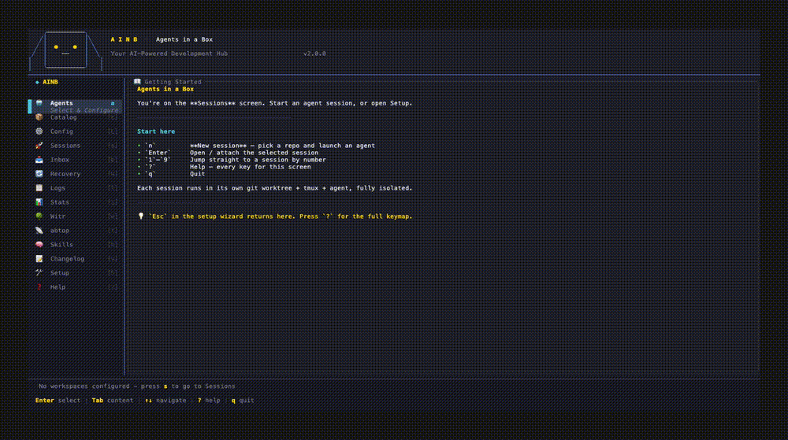

`abtop` surfaces real-time AI coding-agent monitoring inside ainb by wrapping the external [`abtop`](https://github.com/graykode/abtop) binary. It is a **subprocess-wrapping** plugin in the same pattern as [`witr`](./witr.md): pressing `t` in ainb hands the full terminal to abtop's own native TUI, returning to ainb on quit — every abtop key works natively, no translation layer.


*Press `t` from any ainb screen (or select the `abtop` sidebar tile) to open abtop's live agent-monitor full-screen. First launch shows the rate-limit consent dialog.*

## What is abtop?

abtop is a `htop`-style TUI that watches every AI coding agent (Claude Code, Codex, and others) running on the machine: token usage, rate-limit headroom, cost burn, active sessions, and hook-triggered status updates. It is maintained by [graykode](https://github.com/graykode/abtop) and is never bundled into ainb — it is detected at runtime.

## How it works

The screen is a **host-embedded foreign TTY**, exactly like witr. abtop's value is its own live interactive monitor — there is no machine-readable wire format for the live view. Pressing `t` (or the sidebar tile 📡) queues `AsyncAction::AttachAbtop`: ainb runs `tmux new-session -A -d -s ainb-abtop "abtop --exit-on-jump"`, suspends its own TUI, and attaches full-screen to abtop's native monitor. When the user quits abtop, ainb resumes. The plugin's `render` method is never invoked for the screen; this wiring lives entirely in `ainb-core`.

The **CLI** path is different: `ainb abtop [args]` dispatches through `plugin/cli_dispatch` (namespace `abtop`), which execs `abtop --once [args]` — a single non-interactive run that prints a status snapshot and exits. Args are forwarded verbatim so any abtop flag works: `ainb abtop --json`, `ainb abtop --agent claude`, etc.

**First-launch consent** — abtop ships an optional `--setup` hook that installs a Claude Code `StatusLine` hook to feed live rate-limit data. On the very first open of the screen, ainb displays a one-time dialog so the user can opt in (or skip) before anything writes to `~/.claude`. ainb never writes `~/.claude` without an explicit "Enable" choice.

## Capabilities

| Capability | Declared value | Why it is needed |
|---|---|---|
| `spawn_subprocess` | `["abtop"]` | Exec `abtop --version` (detect on init) and `abtop --once` (CLI path). The list form is per-binary audit metadata. |

All other capabilities (`read_sessions`, `read_claude_logs`, `read_codex_logs`, `write_plugin_data`, `event_bus`, `network`) are left at their deny default.

## Using it

### Screen (`t` key)

Press `t` from any ainb screen, or select the `abtop` / "top-for-agents" entry in the sidebar (shortcut `t`, icon 📡).

ainb suspends and full-screen-attaches to abtop's native TUI running inside a managed tmux session (`ainb-abtop`). Every abtop key works natively — ainb does not intercept or translate them. Press `q` (or abtop's quit binding) to close abtop and return to ainb.

If abtop is not on `PATH`, the screen renders an install empty-state with the canonical install command for your platform rather than silently failing.

### First-launch consent dialog



On the very first time the screen is opened, ainb shows a one-time consent dialog:

| Choice | What happens |
|---|---|
| **Enable** | Runs `abtop --setup` to install the Claude Code `StatusLine` hook, then opens the monitor. ainb writes to `~/.claude` only on this path. |
| **Just open abtop** | Opens abtop without running setup. The hook is not installed. Dialog shown again next time. |
| **Don't ask again** | Opens abtop without running setup, and suppresses future prompts. Preference persisted in ainb config. |

You can re-run setup at any time with `ainb abtop --setup` (forwarded verbatim to the binary).

### Live monitor


Once open, you are in abtop's own interactive TUI. All of abtop's modal keys pass through natively. Common navigation (taken directly from abtop):

| Key | Action |
|---|---|
| `↑` / `↓` | Select agent row |
| `Enter` | Jump to selected agent's session |
| `f` | Filter by agent type |
| `s` | Sort column |
| `q` | Quit abtop, return to ainb |

Refer to [abtop's own docs](https://github.com/graykode/abtop) for the full keybinding reference — the keys are abtop's, not ainb's.

### CLI (`ainb abtop`)

`ainb abtop` shells `abtop --once` and exits. Args are forwarded verbatim:

```sh
ainb abtop                     # one-shot status snapshot (default text output)
ainb abtop --json              # JSON output
ainb abtop --agent claude      # filter to Claude Code agents only
ainb abtop --setup             # run first-time rate-limit hook setup
```

If abtop is not found on `PATH`, the CLI prints an install hint and exits with code 1.

## Installing abtop

abtop is an external binary maintained by [graykode](https://github.com/graykode/abtop). ainb detects it at runtime — install whichever way fits your environment:

**macOS (Homebrew — recommended)**

```sh
brew install graykode/tap/abtop
```

**Linux (installer script)**

```sh
curl -sSL https://github.com/graykode/abtop/releases/latest/download/abtop-installer.sh | sh
```

**Any platform (Cargo)**

```sh
cargo install abtop
```

After installing, confirm it is on `PATH`:

```sh
abtop --version
```

ainb picks up the binary on the next launch; no ainb restart is required within an existing session.

## Source

`crates/ainb-plugin-abtop` — detects the external `abtop` binary, owns the `ainb abtop` CLI via `abtop --once` exec, handles first-launch consent state, and renders the missing/install empty state; the foreign-TTY screen handoff (`t` → `abtop --exit-on-jump`) is wired in `ainb-core`.
