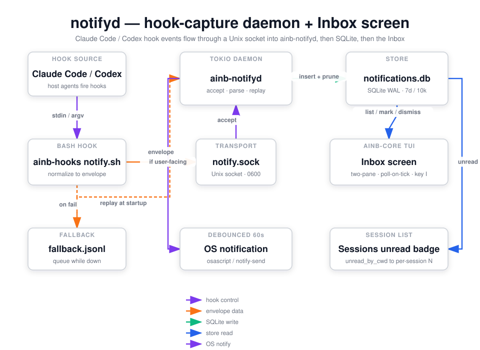

`notifyd` owns the **Inbox** screen and ships a standalone notification daemon (`ainb-notifyd`) that captures Claude Code and Codex lifecycle hook events into SQLite. It is the reference for an **event-capturing, screen-owning** integration — but, unlike the subprocess plugins (`burndown`, `session-reader`, `witr`), it is **compiled in-tree into the host** rather than spawned over JSON-RPC. The `ainb-plugin-notifyd` crate is a library + daemon binary that `ainb-core` links against directly.

## How it works

The capture path starts outside ainb. The `ainb-hooks` plugin (a thin bash hook, `notify.sh`) is installed into Claude Code (`~/.claude/plugins/ainb-hooks/`) and Codex (`~/.codex/hooks.json`). When a host agent fires a lifecycle hook — `SessionStart`, `UserPromptSubmit`, `PostToolUse`, `Notification`, `Stop`, `PreCompact` — the script normalizes the payload into a JSON `Envelope` (`protocol_version`, `agent`, `raw_event`, `session_id`, `cwd`, `project`, `ts`, `payload`) and writes one newline-terminated line to the Unix socket at `~/.agents-in-a-box/notify.sock`. If the socket is absent it lazy-spawns the daemon; if delivery still fails it appends the envelope to `notify.fallback.jsonl`. The hook always exits `0` so a delivery failure never blocks the agent.

`ainb-notifyd` is a tokio accept-loop daemon. On startup it replays (and clears) any queued `notify.fallback.jsonl`, then binds the `0600` socket and writes a PID file. Each accepted connection is parsed into an `Envelope`, persisted via `insert_and_prune`, and — if the event is "user-facing" (a `Stop`, `Notification`, `PermissionRequest`, `agent-turn-complete`, approval/wait event, etc., never telemetry like `SessionStart`) — emitted as a native OS notification, debounced per `(session_id, raw_event)` on a 60s window. Telemetry events are stored but stay silent.

Storage is a dedicated SQLite database, `~/.agents-in-a-box/notifications.db`, opened in WAL mode so the daemon (writer) and TUI (reader) never block each other. It is intentionally separate from `session-reader`'s `usage.db` — different lifecycles, independent migrations. A retention sweep runs on every insert (default: prune rows older than 7 days, cap the table at 10,000 rows, oldest first).

The render side lives in `ainb-core`. The **Inbox** screen (`components/inbox.rs`) holds a long-lived `Store` handle and re-queries SQLite on every render tick (cheap with WAL + `LIMIT 200`). It paints a two-pane list + detail view, and supports mark-read, dismiss, dismiss-all-visible, an archived toggle, and an agent filter. The Sessions screen also reads the store's `unread_by_cwd` grouping to draw a per-session `●N` unread badge, correlating an ainb session to its hook events by working directory. Because `notifyd` is in-tree, it reaches the filesystem, the socket, and the OS notifier directly — there is no JSON-RPC boundary, no `plugin/render` / `plugin/cli_dispatch`, and no `host/snapshot/publish`.

## Capabilities

`notifyd` is **not** a v2 subprocess plugin: it has no `manifest.toml` and declares **no capabilities**. It is part of the host binary (the `ainb-plugin-notifyd` crate is a path dependency of `ainb-core`), so the capability gate that governs subprocess plugins does not apply to it. For reference, the host-side resources it touches directly are:

| Resource | Why it is needed |
|----------|------------------|
| `~/.agents-in-a-box/notifications.db` (SQLite, read+write) | Persist captured envelopes; back the Inbox list and the unread badge. |
| `~/.agents-in-a-box/notify.sock` (Unix socket, `0600`) | Receive envelopes from the `ainb-hooks` script. |
| `~/.agents-in-a-box/notify.pid`, `notify.fallback.jsonl` | Single-instance guard; recover events queued while the daemon was down. |
| `~/.claude/plugins/ainb-hooks/`, `~/.codex/hooks.json` (read+write) | The `install` / `uninstall` verbs wire the hook into the host agents. |
| `osascript` / `notify-send` (subprocess) | Emit the native OS notification for user-facing events. |

## Using it

- **Discoverability surfaces** — three places advertise the Inbox so users don't have to memorise a hidden shortcut:
  - The home screen sidebar lists `📥 Inbox  [b]` between Sessions and Recovery — press `Enter` on the tile, or `b` globally, to open it. (`b` for "in-**B**ox" — picked to avoid the case-pair confusion between `i` Stats and the earlier `I` Inbox binding.)
  - The bottom menu bar (every split-pane screen) always shows `b inbox`. When the store has unread + non-dismissed events the hint becomes `● N · b inbox`, so the global unread count is visible even when the Inbox screen is closed.
  - The Sessions screen renders a `● N` row badge next to any session whose `workspace_path` matches a notification's `cwd` (exact equality or `workspace_path/`-prefix for worktree sub-directories). This is the primary surface — notifications are tied to the session that produced them, not a separate destination.
- **Inbox screen** — press **`b`** from anywhere on the home screen, or `Enter` on the `📥 Inbox` sidebar tile. You get a two-pane list + detail view of captured events. Keys inside the Inbox: `↑`/`↓` (or `k`/`j`) move, `PageUp`/`PageDown` jump 10 rows, `Enter` open + mark read **and jump to the matching session's tmux pane** (via the cwd correlation below), `d` dismiss selected, `Shift+C` dismiss every visible row, `a` toggle archived (dismissed) rows, `p` cycle the agent filter (all → claude → codex), `r` force refresh, `q`/`Esc` back.
- **cwd-based correlation (jump-to-tmux)** — every envelope carries the agent's `cwd` at hook-fire time, and every ainb `Session` carries a `workspace_path`. When the user presses `Enter` on an Inbox row, notifyd resolves the row's `cwd` to the first ainb workspace whose path matches (exact or `workspace_path/`-prefix to cover worktree subdirs), picks a session in that workspace, and queues an `AttachToOtherTmux` action with that session's `tmux_session_name`. There is no shared session-id namespace between the host agents' `session_id` strings and ainb's `Session.id` `Uuid`; the cwd is the bridge.
- **Daemon + installer CLI** — the user-facing CLI is the standalone `ainb-notifyd` binary (not an `ainb <ns>` subcommand). Verbs:
  - `ainb-notifyd run` — run the daemon in the foreground (default if no subcommand). The hook script lazy-spawns it as `ainb notifyd` when the socket is missing.
  - `ainb-notifyd install --claude --codex` (or `--all`) — install the `ainb-hooks` hook for the chosen agents.
  - `ainb-notifyd uninstall --claude --codex` (or `--all`) — reverse the install; preserves user-authored Codex hooks.
  - `ainb-notifyd status` — report per-agent install state, hook-script health, socket liveness, last event, and daemon PID liveness.
  - `ainb-notifyd stop` — send `SIGTERM` to a running daemon via its PID file.
- **Snapshot topics** — none. `notifyd` does not publish or subscribe on the event bus; the Inbox reads SQLite directly. There is no slash command.

## Source

`crates/ainb-plugin-notifyd` — in-tree library + `ainb-notifyd` daemon binary: envelope wire format, the SQLite `Store`, the tokio listener, OS-notify dispatch, and the `ainb-hooks` install/uninstall logic. The Inbox screen itself lives in `crates/ainb-core/src/components/inbox.rs`. Diagram generated via /fireworks-tech-graph.
