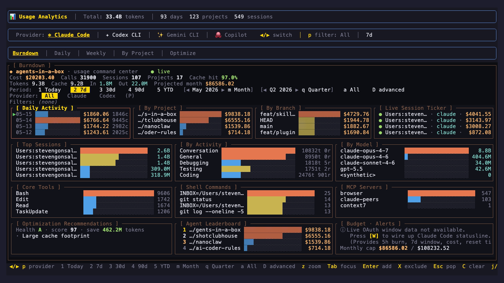

# ainb v2 plugins — overview

What a v2 subprocess plugin is, conceptually. New here? Read [README.md](./README.md) first — it disambiguates from Claude Code plugins.

For the user CLI flow, jump to [user-guide.md](./user-guide.md). To write one, [authoring.md](./authoring.md). For the wire contract, [spec-v2.md](./spec-v2.md).

## What is a plugin?

A plugin is a self-contained capsule that adds a screen, CLI subcommand, sidebar entry, or statusline segment to ainb without recompiling the host. A v2 plugin is a **native executable** the host spawns as a child process; the two talk JSON-RPC 2.0 over framed stdio.

Plugins only see the host capabilities they declare in their manifest, and they cannot reach the network, filesystem, or subprocess launcher unless you grant those capabilities.

## What a plugin can own

- **A TUI screen** — implement `Plugin::render` and paint a `WireBuffer` per frame; the host blits it onto the terminal.
- **A CLI subcommand tree** — claim a `cli_namespaces` entry in your manifest; the host dispatches `ainb <ns> ...` invocations through `Plugin::cli_dispatch`.
- **Snapshot topics (publish/subscribe)** — push data on a topic via `HostClient::snapshot_publish`; subscribers (other plugins or the host) get `plugin/handle_event` deliveries.
- **A statusline segment** — own a slice of the persistent status bar.
- **Its own state** — write under `~/.agents-in-a-box/plugins/<name>/` (gated by `write_plugin_data`).
- **Host actions** — invoke host-owned operations via `host/action/invoke` (gated by capability).

## Reference plugins

Three plugins ship in-tree as the canonical examples:

- **`burndown`** — owns the Analytics screen and the `ainb usage` CLI subcommand tree. Full screen-owner reference.
- **`notifyd`** — owns the Inbox screen and runs a notification daemon that captures Claude Code and Codex hook events into SQLite (binary `ainb-notifyd`; also installs/uninstalls the `ainb-hooks` agent hooks). Reference for an event-capturing, screen-owning plugin.
- **`session-reader`** — pure publisher. Scans `~/.claude/projects/**` and `~/.codex/sessions/**` and chunked-publishes usage snapshots on the `sessions.usage_data` topic for `burndown` to render. Canonical publisher example.

<p align="center">
  
  <br>
  <em>The burndown plugin rendering the full analytics dashboard against real <code>~/.claude/projects</code> data.</em>
</p>

## Where plugins live on disk

The host discovers plugins from a flat staging directory:

```text
dist/plugins/
├── burndown/
│   ├── burndown            (native executable, ad-hoc signed on macOS)
│   └── manifest.toml
├── notifyd/
│   ├── ainb-notifyd
│   └── manifest.toml
└── session-reader/
    ├── session-reader
    └── manifest.toml
```

That layout is what `just stage-plugins` produces from in-tree crates, and what the host walks on startup. The `AINB_PLUGIN_ROOT` env var overrides it (defaults to `<workspace-root>/dist/plugins`).

Plugin-writable state lives under `~/.agents-in-a-box/plugins/<name>/` (override with `AINB_HOME`), gated by the `write_plugin_data` capability.

## Capability model (summary)

Every plugin declares the host capabilities it needs in its `manifest.toml`:

```toml
[capabilities]
read_sessions       = true     # ~/.agents-in-a-box/sessions/**
read_claude_logs    = true     # ~/.claude/projects/**/*.jsonl
read_codex_logs     = false    # ~/.codex/sessions/**/*.jsonl
write_plugin_data   = true     # ~/.agents-in-a-box/plugins/<name>/ writable
event_bus           = true     # publish/subscribe across plugins
spawn_subprocess    = false    # exec child processes
network             = []       # bool or hostname allow-list
```

Default for every flag is **deny** (`false` / `[]`). The runtime rejects host-fn calls against a capability the manifest doesn't grant with JSON-RPC error code `-32001` (`CAPABILITY_DENIED`).

Full semantics: [spec-v2.md §1](./spec-v2.md#1-manifest) and [spec-v2.md §9](./spec-v2.md#9-capability-gates).

## Versus the deprecated v1 wasm contract

v1 used `wasm32-wasip1` cdylibs in a wasmi host runtime with linker-omitted host-fn imports for capability gating. v2 dropped wasm entirely — a normal `cargo build` binary, native code, OS-process boundary. The wasm sandbox added implementation cost without buying any safety property the OS process boundary doesn't already provide for ainb's threat model.

## Next steps

- **End user?** [user-guide.md](./user-guide.md) — every `ainb plugin` command.
- **Building a plugin?** [authoring.md](./authoring.md) — Rust SDK, scaffolding, debugging.
- **Implementing a host?** [spec-v2.md](./spec-v2.md) — the wire contract.
