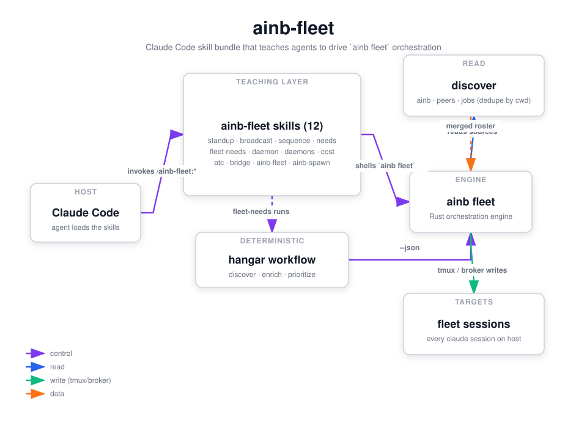

`ainb-fleet` (v0.1.0) is a **Claude Code plugin** — loaded by Claude Code itself, not by the ainb TUI — that ships a bundle of LLM-facing skills teaching an agent how to use the `ainb fleet ...` orchestration subcommands: broadcasting a prompt to many sessions, ack-gated step sequences, surfacing blocked sessions ("needs"), an auto-continue daemon, and a fleet standup. The orchestration logic itself lives in the `ainb` Rust binary; this plugin is purely the teaching layer that points the agent at the right command for the job. It replaces the deprecated `popa` plugin, whose Node code is gone.

## How it works



This plugin registers **no hooks, no commands, and no agents** — it is a pure skill bundle. When you invoke one of its colon-namespaced skills (`/ainb-fleet:standup`, `/ainb-fleet:broadcast`, etc.), the skill teaches the agent the exact `ainb fleet ...` invocation to shell out to. All the real work — discovering sessions, reading transcripts, routing writes — happens inside the `ainb` Rust binary.

The fleet engine discovers sessions from three sources — every session `ainb` has spawned, sessions registered with the claude-peers broker (`~/.claude-peers.db`), and background-job dirs under `~/.claude/jobs/` — then merges and dedupes them by `cwd`. Reads go through the source of truth (JSONL transcripts plus tmux pane buffers); writes go out peers-first via the broker when a peer is registered, falling back to `tmux send-keys` literal mode otherwise.

The bundle has a top-level router skill (`ainb-fleet`) that maps the five verbs to their focused sub-skills, plus a workflow-backed variant of `needs`. The `fleet-needs` skill runs the deterministic `hangar` workflow (verb=`needs`: discover → enrich → prioritize → render-ready cards), then renders a "Jarvis HUD" of every blocked session and fires an `AskUserQuestion` per session so the user can answer the whole fleet in one batch; answers are routed back to each target's tmux pane.

The daemon skill describes a long-running watcher that scans each session's recent pane buffer every 5 seconds and auto-sends `continue` to any session whose buffer matches a known API-error regex (`rate_limited`, `overloaded_error`, `internal_server_error`, `request_timeout`, `socket_hang_up`, `fetch_failed`, `connection_reset`), deduping on `(session_id, pattern, match-context)` so it fires once per error.

## What it provides

### Skills

| Skill | Purpose |
|---|---|
| `ainb-fleet` | Overview / router — at-a-glance map of the five fleet verbs, discovery sources, and global flags |
| `ainb-fleet:standup` | List every claude session on the host, merged + deduped across ainb · peers broker · bg jobs |
| `ainb-fleet:broadcast` | Fan one prompt out to selected sessions (requires `--all`, `--filter <regex>`, or `--cwd <substring>`) |
| `ainb-fleet:sequence` | Send ordered multi-step prompts, ack-gated between steps via JSONL turn-end detection |
| `ainb-fleet:needs` | Center control panel — enumerate sessions blocked on ASK / ERR / IDLE / WAIT signals, render the Jarvis HUD |
| `ainb-fleet:fleet-needs` | Workflow-backed `needs` — runs the `hangar` workflow, renders the HUD, fires `AskUserQuestion`, routes answers back |
| `ainb-fleet:daemon` | Background watcher that auto-`continue`s sessions matching an API-error regex |

### Workflow

| Workflow | Purpose |
|---|---|
| `hangar` | Multi-verb deterministic orchestrator (verbs: `needs` / `standup` / `sequence`). Discover → enrich (per-session, Haiku by default) → prioritize / group / step. Backs the `fleet-needs` skill. |

### Hooks / Commands / Agents

None — this plugin registers no lifecycle hooks, slash commands, or sub-agents.

## Install

```sh
claude plugin install ainb-fleet@agents-in-a-box
```

The plugin is published via this repo's root `.claude-plugin/marketplace.json` (marketplace name `agents-in-a-box`). It requires the `ainb` binary on `PATH` to do any real work — the skills shell out to `ainb fleet ...`.

## Using it

- **Get a fleet roster:** `/ainb-fleet:standup` (add `--format json` to pipe into `jq`).
- **Apply one instruction everywhere:** `/ainb-fleet:broadcast` — e.g. `ainb fleet broadcast "/clear" --filter "shotclubhouse"`. A targeting flag is mandatory to prevent accidental fan-out.
- **Run an ordered cycle:** `/ainb-fleet:sequence` — e.g. disconnect → reconnect → verify, waiting for each step's assistant turn-end before the next.
- **See what wants your attention:** `/ainb-fleet:needs` (or `/ainb-fleet:fleet-needs` when `CLAUDE_CODE_WORKFLOWS=1`) renders a HUD of every blocked session and lets you answer them in one `AskUserQuestion` batch.
- **Unattended error recovery:** `/ainb-fleet:daemon` runs a watcher that auto-`continue`s sessions hitting transient API errors (run via `nohup ... &` for real background use).

## Source

`plugins/ainb-fleet/` — a Claude Code skill bundle (7 skills + the `hangar` workflow) teaching agents to drive the `ainb fleet` Rust subcommands. Diagram generated via /fireworks-tech-graph.
