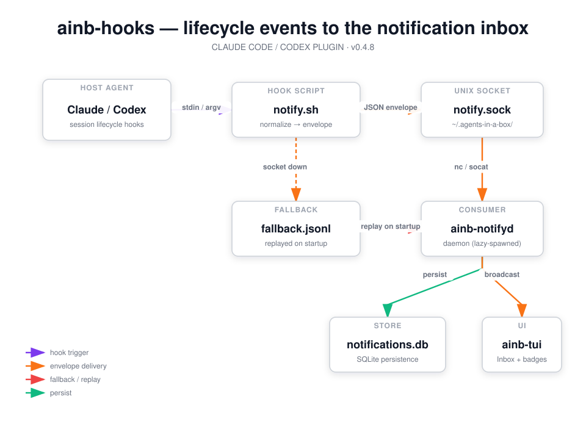

`ainb-hooks` (v0.2.0) is a **host-agent hook plugin** — it is loaded by Claude Code, Codex CLI, or GitHub Copilot CLI, not by the `ainb` TUI. (Contrast with the ainb v2 subprocess plugins such as `burndown` and `witr`, which run inside `ainb`.) It registers lifecycle hooks on the host agent and forwards each event to the **ainb notification inbox** — the `ainb-notifyd` daemon — over a Unix socket, powering session-state badges, the Inbox screen, and optional OS notifications in `ainb-tui`. It pairs with the [Inbox & notifications](../../tui/inbox-notifications.md) daemon (`ainb-notifyd`) — host code compiled into `ainb-core`, not a plugin — which is the consumer on the other end of the socket.

## How it works



The plugin's `.claude-plugin/plugin.json` registers only the **actionable** lifecycle events with a single command: `AINB_AGENT=claude ${CLAUDE_PLUGIN_ROOT}/hooks/notify.sh`. Codex is registered via `codex/hooks.json` (with `AINB_AGENT=codex`), and Copilot via `copilot/hooks.json` (with `AINB_AGENT=copilot`). Each hook has a 5-second timeout so a slow delivery never stalls the agent.

**Only events that need the human are hooked** — Claude/Copilot use `Notification`/`notification` for awaiting input and permission prompts, Codex uses `PermissionRequest` for approvals, and all three use `Stop`/`agentStop` for turn completion. Telemetry — `SessionStart`, `UserPromptSubmit`, `PreToolUse`, `PostToolUse`, `PreCompact`, `PostCompact`, `SubagentStart`, `SubagentStop` — is **not** registered: `PostToolUse` alone fires dozens of times per turn and would bury the signal in the inbox. As a second line of defence, `ainb-notifyd` also drops any non-user-facing event on arrival (see `crates/ainb-plugin-notifyd/src/listener.rs`), so even a stale install never accumulates noise.

`hooks/notify.sh` is the universal normalizer. Claude Code pipes the hook payload as JSON on stdin; Codex passes it as `argv[1]`. The script autodetects the source, extracts the event name, session id, and cwd (via `jq`, falling back to `grep` in minimal environments), and wraps the verbatim original payload in a normalized envelope: `{protocol_version, agent, raw_event, session_id, cwd, project, ts, payload}`. The `raw_event` field preserves the original event name (e.g. `Notification:idle_prompt`) so semantic mapping happens in the consumer, not on the wire.

Delivery targets `~/.agents-in-a-box/notify.sock` via `nc` (or `socat`). If the socket is absent, the script attempts a best-effort lazy spawn of `ainb notifyd` (guarded by an atomic lock directory) and retries once. If that still fails, it appends the envelope to `~/.agents-in-a-box/notify.fallback.jsonl`, which `ainb-notifyd` replays and clears on its next startup. The hook always exits 0, so a delivery failure never blocks the host agent.

Downstream, `ainb-notifyd` persists envelopes to a SQLite `notifications.db` and broadcasts them to `ainb-tui` for live inbox/badge updates.

## What it provides

This plugin ships only hooks plus the shared `notify.sh` script — no skills, commands, or agents.

### Hooks

Only the events that need the human are registered:

| Agent | Event | What fires | Why it's actionable |
| --- | --- | --- | --- |
| Claude Code | `Notification` | Agent notifications, incl. `Notification:idle_prompt` and permission prompts | the agent is blocked on you |
| Claude Code | `Stop` | Agent turn / session stops | the agent finished — come back |
| Codex CLI | `PermissionRequest` | Exec / patch / permission approval prompts | the agent is blocked on approval |
| Codex CLI | `Stop` | Agent turn / session stops | the agent finished — come back |
| GitHub Copilot CLI | `notification` | Agent notifications and permission prompts | the agent is blocked on you |
| GitHub Copilot CLI | `agentStop` | Agent turn / session stops | the agent finished — come back |

Deliberately **not** registered (telemetry / activity noise — would bury the signal): `SessionStart`, `UserPromptSubmit`, `PreToolUse`, `PostToolUse`, `PreCompact`, `PostCompact`, `SubagentStart`, `SubagentStop`. `PostToolUse` alone fires once per tool call (dozens per turn). The daemon additionally drops any non-user-facing event on arrival as a safety net.

### Components

| File | Purpose |
| --- | --- |
| `.claude-plugin/plugin.json` | Claude Code plugin manifest (`hooks` block, name, version) |
| `codex/hooks.json` | Codex `~/.codex/hooks.json` merge template (`__AINB_HOOK_SCRIPT__` placeholder) |
| `copilot/hooks.json` | Copilot `~/.copilot/hooks/ainb.json` drop-in template |
| `hooks/notify.sh` | Universal hook script — normalizes the payload and delivers it to the socket |

## Install

`ainb-hooks` is published in the `agents-in-a-box` plugin marketplace, but you don't install it by hand — the `ainb-notifyd` binary's installer wires it for the chosen agents and manages the notifyd lifecycle:

```bash
ainb-notifyd install --claude --codex --copilot
ainb-notifyd status
ainb-notifyd uninstall --all
```

For **Claude**, the installer shells out to the `claude` plugin CLI — ensuring the `agents-in-a-box` marketplace is known, then `claude plugin install ainb-hooks@agents-in-a-box` (idempotent; "already installed" counts as success) — so Claude resolves and runs the plugin's bundled `notify.sh`. For **Codex**, it merges `codex/hooks.json` into `~/.codex/hooks.json` as a managed block, extracts `notify.sh` to `~/.agents-in-a-box/hooks/notify.sh`, and rewrites the `__AINB_HOOK_SCRIPT__` placeholder to that absolute path. For **Copilot**, it writes `copilot/hooks.json` as a standalone drop-in at `~/.copilot/hooks/ainb.json`. The install method is recorded in `~/.agents-in-a-box/install.json` so uninstall is fully reversible (`claude plugin uninstall` for Claude, managed-block removal for Codex, drop-in deletion for Copilot).

> The plugin's README recommends a higher-level `ainb hooks install` wrapper; that `ainb hooks` CLI is planned but not yet on `main`, so use `ainb-notifyd install` (above) today.

## Using it

- Once installed, delivery is fully automatic — every registered actionable event on the host agent (`Notification`/`notification`, `PermissionRequest`, `Stop`/`agentStop`) is forwarded to the inbox with no user action. Telemetry events are not hooked, so the inbox only ever shows things that need you.
- `Notification:idle_prompt` and `PermissionRequest` events surface in `ainb-tui` as attention markers so you can see which sessions need you.
- Events show up as session-state badges and in the dedicated Inbox screen in `ainb-tui`; the inbox detail view exposes the full original hook JSON (carried in `payload`) for forensics.
- Run `ainb-notifyd status` to confirm the plugin is wired for each agent; if `ainb-notifyd` is not running, the next hook fire lazily spawns it (or buffers to the fallback file).

## Source

`plugins/ainb-hooks/` — a thin hook plugin: a manifest plus one `notify.sh` normalizer shared by Claude Code and Codex. Diagram generated via /fireworks-tech-graph.
