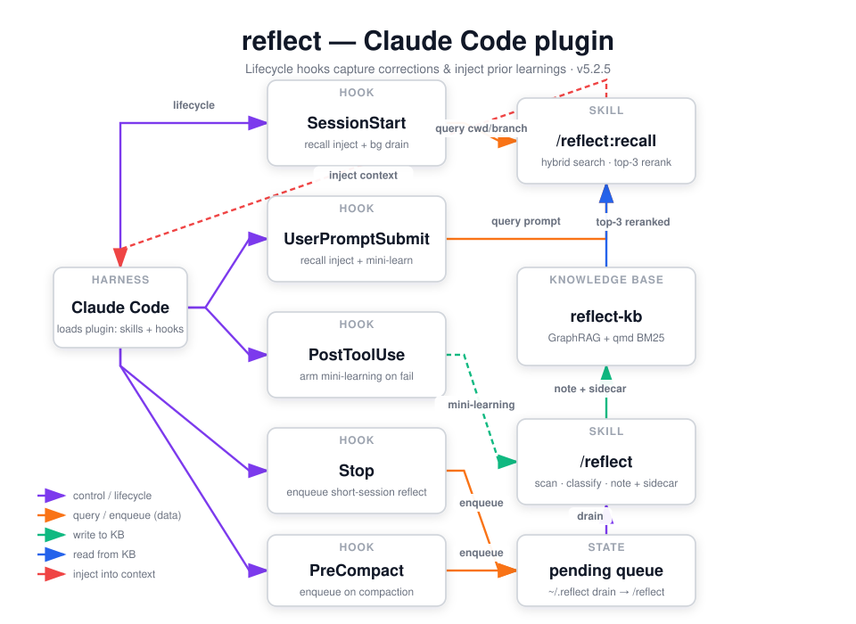

`reflect` is a **Claude Code plugin** — it is loaded by Claude Code (Anthropic's plugin system: skills + hooks + commands), not by the ainb TUI. It captures the corrections and design decisions you make in a session as structured learnings, indexes them into a hybrid GraphRAG + BM25 knowledge base, and auto-injects the most relevant prior learnings into every new session. Philosophy: *correct once, never again; recall everything next time.* Current version: **3.6.0**.

## How it works



The plugin manifest registers five lifecycle hooks. **`SessionStart`** runs two commands: `session_start_recall.py` builds a query from the session's cwd, branch, and recent commits and injects the top-3 reranked learnings as `additionalContext`; and `reflect-drain-bg.sh` launches a detached background drainer that processes any reflections queued from prior sessions. **`UserPromptSubmit`** re-runs recall using the actual prompt as a sharper query (with per-session dedupe), and also completes the mini-learning capture — if a tool just failed and the prompt looks like a correction, it writes a low-confidence learning straight to disk without spending an LLM call.

**`PostToolUse`** is the first half of that cheap capture path: when a tool call fails, it arms a watcher so the next `UserPromptSubmit` can detect a correction. **`Stop`** enqueues short sessions (that ended before compaction) for asynchronous reflection, and **`PreCompact`** enqueues long sessions when Claude Code compacts the conversation — both feed the same `~/.reflect/pending_reflections.jsonl` queue, deduped by `session_id`.

Capture and indexing run through the sub-skills. `/reflect` scans a conversation, classifies corrections vs. successes, and writes a Markdown learning note plus a YAML entity sidecar (people, files, libraries, decisions). The background drainer replays queued transcripts through the same `/reflect` skill headlessly. Everything is dual-indexed into **reflect-kb** — nano-graphrag for semantic + entity-graph search and qmd for fast BM25 lexical search — both running locally.

Retrieval closes the loop: `/reflect:recall` (the same engine the SessionStart and UserPromptSubmit hooks call automatically) runs hybrid search, reranks by confidence × recency × tag overlap, and surfaces the strongest learnings back into the agent's context before the first token is generated.

## What it provides

### Skills

| Skill | Purpose |
|-------|---------|
| `reflect` | Full conversation scan — detect behavioral corrections and knowledge signals, classify them, write a learning note with an entity sidecar for GraphRAG indexing |
| `reflect:recall` | Retrieve relevant prior learnings from the global KB via hybrid vector + graph search, reranked by confidence, recency, and tag overlap (also runs automatically at SessionStart / UserPromptSubmit) |
| `reflect:ingest` | The global knowledge indexer — harvest ALL memory sources across tools (Claude, Codex, Copilot, Gemini) into the unified GraphRAG + qmd KB, archiving originals and generating entity sidecars |
| `reflect:consolidate` | Project-level memory consolidation — merge orphaned worktree memory dirs into a single `.agents/MEMORY.md` (deduplicates and sections; does not index into the global KB) |
| `reflect:errors-ack` | Triage and acknowledge entries in the reflect errors sink (`~/.reflect/errors.json`) — drain poison, parser crashes, ingest failures, hook timeouts; invoked from the statusline ⚠N badge |
| `reflect-status` | Read-only metrics — pending reviews, sidecar coverage, GraphRAG health; can approve/reject pending low-confidence items |

### Hooks (registered in `plugin.json`)

| Event | What fires |
|-------|-----------|
| `SessionStart` | `session_start_recall.py` injects top-3 learnings from cwd/branch/commits, plus a detached `reflect-drain-bg.sh` that drains the pending-reflections queue in the background |
| `UserPromptSubmit` | `user_prompt_submit_recall.py` re-runs recall against the actual prompt (deduped) and writes a mini-learning if a prior tool failure is being corrected |
| `PostToolUse` | `posttooluse_minilearning.py` arms a mini-learning watcher when a tool call fails (cheap, no LLM call) |
| `Stop` | `stop_reflect.py` enqueues short sessions for asynchronous reflection, deduped against PreCompact |
| `PreCompact` | `precompact_reflect.py --auto --verbose` enqueues the transcript for reflection when Claude Code compacts the conversation |

## Install

```bash
claude plugin marketplace add stevengonsalvez/agents-in-a-box
claude plugin install reflect@agents-in-a-box

# install the underlying CLI (provides nano-graphrag + qmd)
uv tool install --force --upgrade 'git+https://github.com/stevengonsalvez/agents-in-a-box.git#subdirectory=reflect-kb[graph]'
```

The plugin is published via the repo's root `.claude-plugin/marketplace.json` (marketplace name `agents-in-a-box`). Codex CLI and GitHub Copilot don't have a native plugin runtime — for those, use the Python adapters under `plugins/reflect/adapters/<codex|copilot>/`.

## Using it

- **Mostly automatic.** Once installed, the SessionStart hook fires `recall` at the start of every new session and surfaces relevant prior learnings before you type. UserPromptSubmit sharpens that with the actual prompt on each turn.
- **Capture happens for free.** Failed tool calls + correction-shaped follow-ups become low-cost mini-learnings, and short / compacted sessions are queued and drained in the background — no manual step required.
- **`/reflect`** — run it explicitly to scan the current conversation and write a learning note when you want to capture something deliberately.
- **`/reflect:recall "<anything>"`** — query the knowledge base on demand.
- **`/reflect:ingest`** — periodically bulk-index existing memories from any tool into the global KB.
- **`/reflect:consolidate`** — merge scattered worktree memory dirs into one project `.agents/MEMORY.md`.
- **`/reflect-status`** — view pipeline metrics, pending reviews, and KB health; approve/reject low-confidence items.
- **`/reflect:errors-ack`** — triage the errors sink when the statusline shows a ⚠N badge.

## Source

`plugins/reflect/` — Claude Code plugin (skills + lifecycle hooks) backed by the `reflect-kb` GraphRAG + qmd library. Diagram generated via /fireworks-tech-graph.
