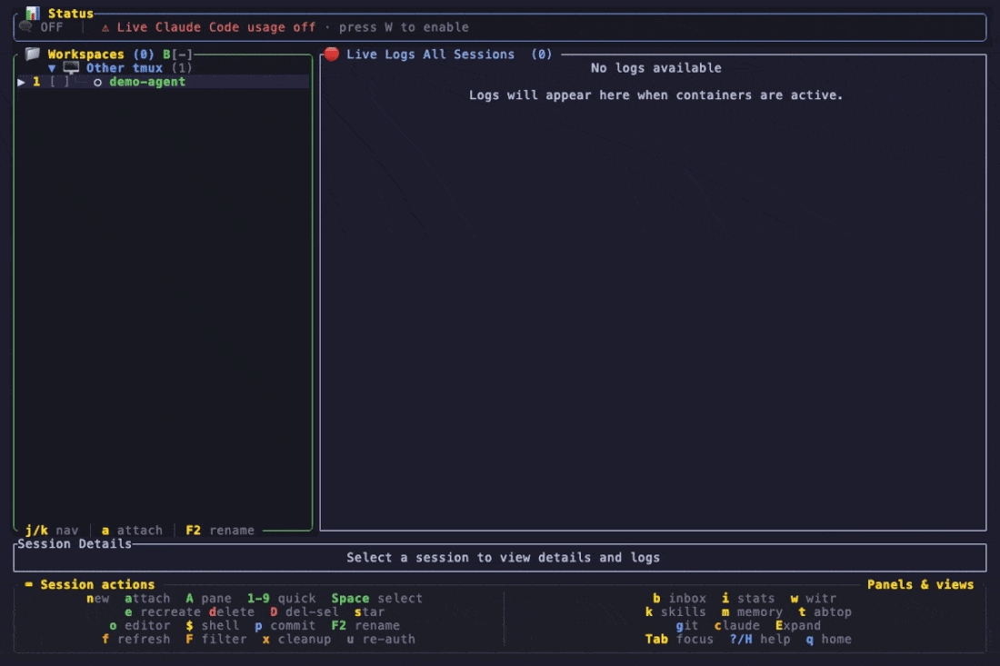
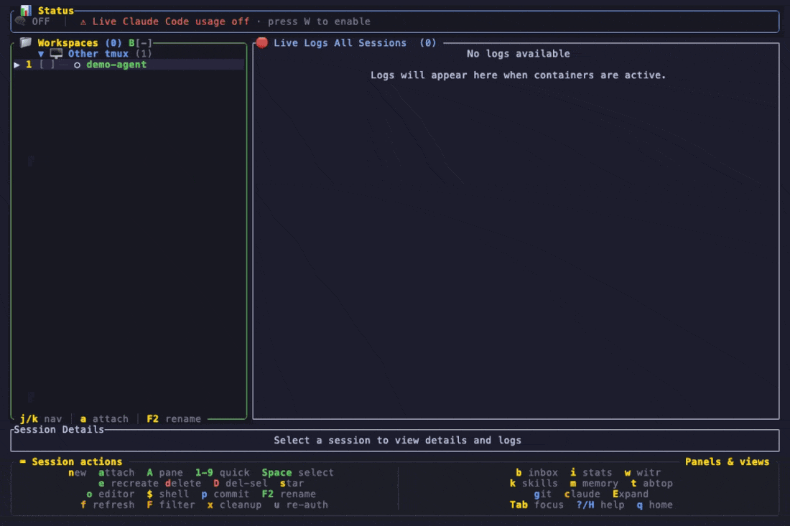

Every row in the session list — agent sessions, workspace shells, and foreign sessions under **Other tmux** — is backed by a real tmux session, and there are two ways to step inside it. Press **`a`** for a **full-screen attach**: the TUI suspends and the genuine tmux client takes over your terminal. Press **`A`** (Shift+A) for an **in-pane attach**: the right pane becomes a **live embedded tmux client** without leaving ainb — a **`● INTERACTIVE — Ctrl+Q release`** badge appears, the sidebar collapses to a thin rail so the embed gets near-full width, and everything you type goes straight into the session. Either way, leaving the session **never kills it** — detach and release only disconnect the client; the session keeps running.

## Full-screen attach (`a`)



*Press `a` on a session: the TUI suspends and `tmux attach-session` fills the whole terminal — tmux status bar, scrollback, prefix keys, everything. Detach with `Ctrl+B` `d` and ainb resumes exactly where you left it, with the session still listed.*

```text
s                       open the session list (session selected under "Other tmux")
a                       full-screen attach — the TUI suspends, tmux takes the terminal
echo FULLSCREEN_OK ⏎    typed straight into the session
Ctrl+B d                detach — ainb resumes, the session keeps running
```

This is a plain `tmux attach-session` on your terminal: every tmux feature works (prefix bindings, copy mode, panes, mouse per your tmux config). Use it when you want to *work in* the session for a while.

## In-pane attach (`A`)



*Press `A` (Shift+A): the pane becomes the live session in-place. The `● INTERACTIVE — Ctrl+Q release` badge marks the handoff, the session list collapses to a thin rail so the embed gets near-full width, and keystrokes land in the session. `Ctrl+Q` releases: the sidebar restores and the session keeps running.*

```text
s                       open the session list
A                       in-pane attach — INTERACTIVE badge, sidebar collapses to a rail
echo INPANE_OK ⏎        typed input lands in the embedded session, output renders live
Ctrl+Q                  release — sidebar restores, badge gone, the session survives
```

While the embed is interactive, **all input belongs to the session**: keys are encoded to terminal bytes for the embedded client, and the mouse is forwarded as SGR events — the wheel scrolls the session's scrollback (tmux copy-mode), clicks land where you point. `Ctrl+Q` is the single escape hatch ainb keeps for itself. Releasing kills only the ephemeral embedded client — never the tmux session — and the pane returns to its read-only preview.

Use the in-pane attach for quick interventions — answer an agent's prompt, nudge a stuck command — without losing the session list and the rest of ainb's chrome around you.

## The two modes side by side

| | `a` full-screen | `A` in-pane |
|---|---|---|
| Surface | whole terminal (TUI suspends) | right pane (ainb chrome stays) |
| Visual cue | tmux status bar fills the screen | `● INTERACTIVE — Ctrl+Q release` badge, sidebar rail |
| Leave with | `Ctrl+B` `d` (tmux detach) | `Ctrl+Q` |
| Lands you | back in ainb, session still listed | sidebar restored, read-only preview back |
| tmux session | survives | survives |

## Keys

| Key | Action |
|-----|--------|
| `a` | Full-screen attach to the selected session |
| `A` | In-pane attach — the preview pane becomes a live embedded tmux client |
| `Ctrl+B` `d` | Detach from a full-screen attach (standard tmux detach) |
| `Ctrl+Q` | Release the in-pane embed (only key ainb intercepts while interactive) |
| `1`–`9` | Quick-attach by the number badge next to each attachable row |
| `B` | Toggle the sessions sidebar (the keyboard twin of the `[-]`/`[+]` glyph) |
| **Mouse** | Forwarded into the embed while interactive; wheel scrolls tmux scrollback/copy-mode |

## How it works

The embed drives a real `tmux attach-session` inside a PTY sized to the pane interior: output is parsed by a vt100 screen and rendered in place, key events are encoded to the exact terminal byte sequences a terminal would send, and mouse events are translated into pane-local SGR (mode 1006) reports. Entering the embed collapses the session list to a thin rail so the pane expands to near-full width; releasing restores the split. The full-screen path is simpler still — the TUI suspends, hands the terminal to `tmux attach-session`, and resumes when the client detaches. In both modes the client is the only thing that dies on exit; the tmux session and whatever is running inside it are untouched.

## See also

- [Keyboard shortcuts](keyboard-shortcuts.md)
- [Overview](overview.md)
