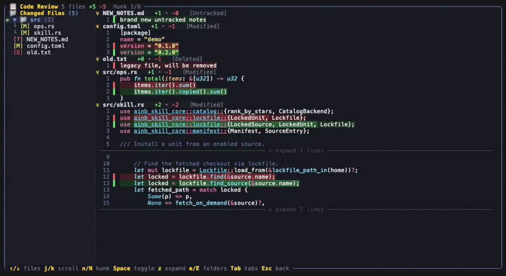
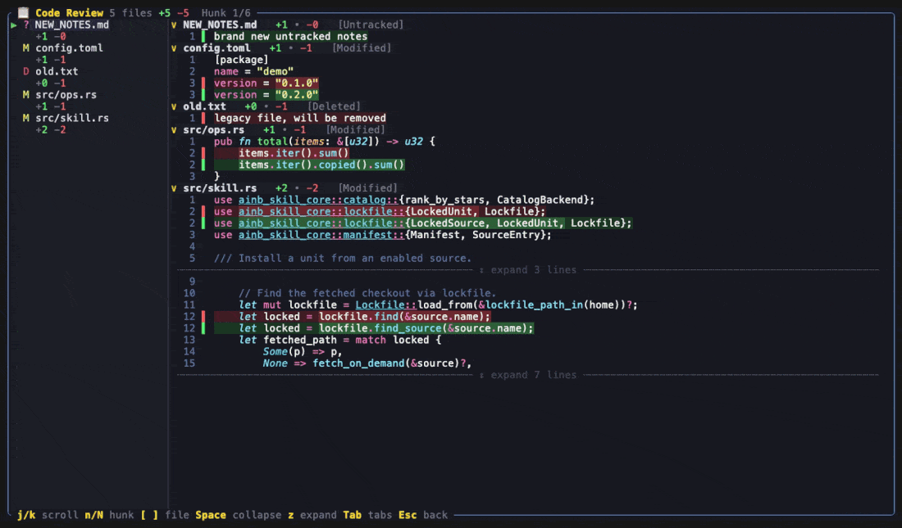
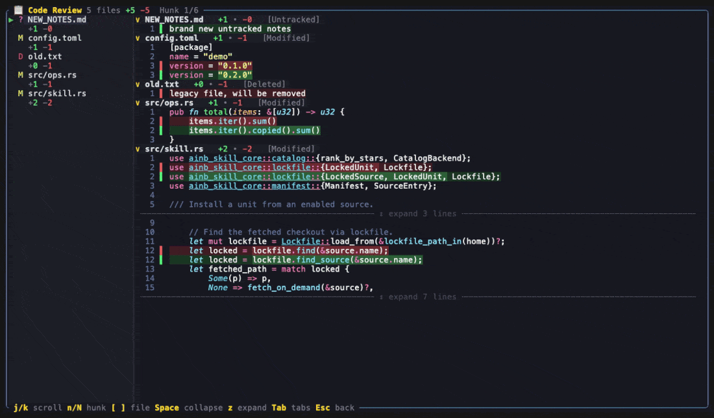
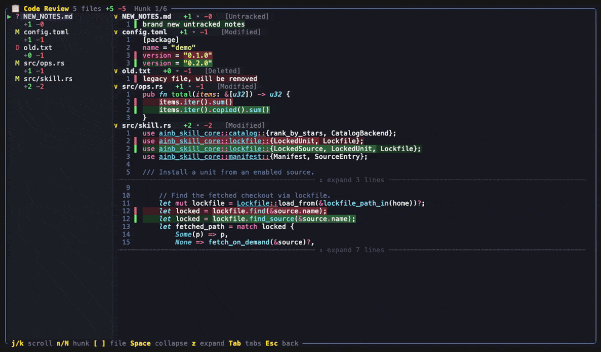

The **Code Review** surface is how `ainb` shows a session's git changes. Press **`g`** on a session to open it, or run **`ainb diff-review [path]`** to review any repository directly — no session required. It replaces the old line-prefixed diff with a cohesive review surface: a left **hierarchical file tree** (folders, chevrons, nested files) plus **per-file collapsible diff blocks** in one continuous scroll, full **Dracula syntax highlighting**, **word-level intra-line emphasis** (the exact changed substring glows brighter inside the muted row tint), a **line-number gutter** with solid green/red change bars, **expandable context**, and **hunk navigation**. It is fully **mouse-driven** too.



*Press `g` on a session (or `ainb diff-review .`) to open the review. The sidebar lists every changed file with its `+N -M` counts; the body shows all files' diffs in one scroll with Dracula syntax colours, green/red row tints, and a `Hunk x/y` counter.*

## Keys

| Key | Action |
|-----|--------|
| `g` | Open the Code Review surface for the selected session |
| `↑` / `↓` | Move the selection across the file tree (landing on a file scrolls the body to it) |
| `j` / `k` | Scroll the diff body |
| `n` / `N` | Jump to the next / previous hunk (with a `Hunk x/y` counter) |
| `Space` / `Enter` | Toggle a folder, or collapse/expand the selected file's diff block |
| `e` / `E` | Expand / collapse all folders |
| `z` | Reveal more hidden context at the nearest gap |
| `[` / `]` | Select the previous / next file |
| **Mouse** | Wheel scrolls the diff; click a tree row to select a file or toggle a folder |
| `Tab` | Cycle Review → Commits → Markdown |
| `Esc` / `q` | Back |

## Word-level emphasis

When a line changes, the whole row gets a muted green (added) or red (removed) tint — and the **exact substring that changed** gets a brighter highlight. In the import line below, only `LockedSource,` is brighter; the rest of the row carries the flat tint. This makes the real edit jump out even on lines that are otherwise nearly identical.



## Collapse & expand context

Each file's diff block can be collapsed to just its header (`Space`/`Enter`), and the surrounding unchanged lines are hidden behind a `↕ expand N lines` affordance — press `z` to reveal more. Large diffs stay readable because only the changed regions (plus a little context) are shown by default.



## Hunk navigation

`n` / `N` jump between hunks across all files, scrolling each to the top and advancing the `Hunk x/y` counter in the title.



## `ainb diff-review`

The same surface is available as a standalone command:

```bash
ainb diff-review            # review the current repo's open changes
ainb diff-review ./path     # review another repo
```

This opens the Code Review surface directly for a repository's uncommitted changes (HEAD vs working tree, including untracked and deleted files) with the same keys. `q` or `Esc` exits back to the shell.

## How it works

`ainb` enumerates changed files with `git2` (HEAD blob vs working-tree file, untracked and deleted handled), then re-diffs each file with the [`similar`](https://crates.io/crates/similar) crate to produce structured hunks **and** word-level inline changes in one pass. Code is highlighted with [`syntect`](https://crates.io/crates/syntect) using the extended grammars and Dracula theme from [`two-face`](https://crates.io/crates/two-face); the syntect foreground is composited over the diff-tint background so a line keeps its syntax colours while gaining a green/red row tint, with a brighter tint over the word-emphasis ranges. The surface renders only the visible window of a flattened row list, so even large diffs stay responsive.

## See also

- [Keyboard shortcuts](keyboard-shortcuts.md)
- [Overview](overview.md)
