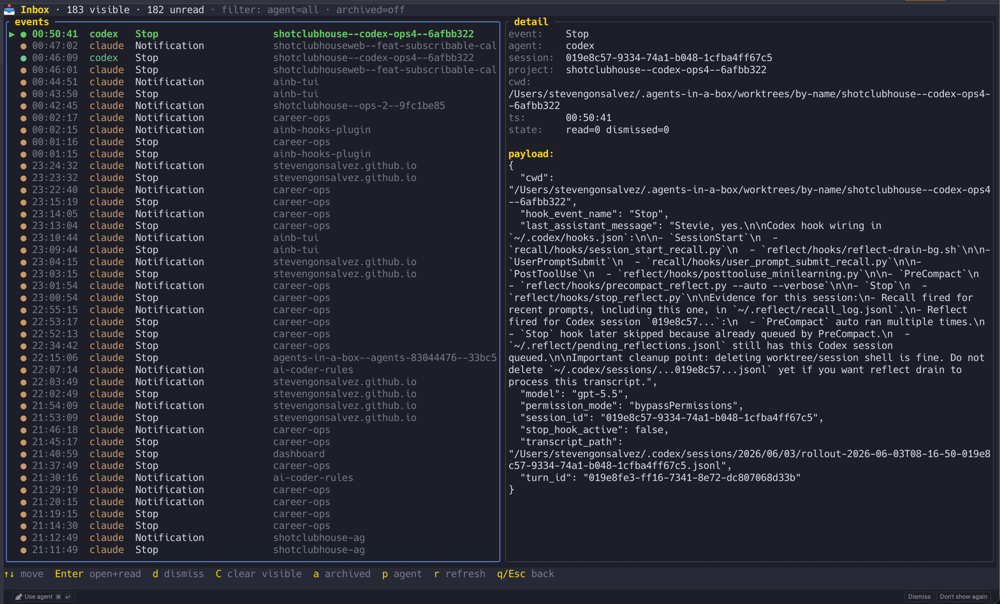
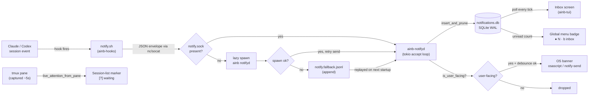
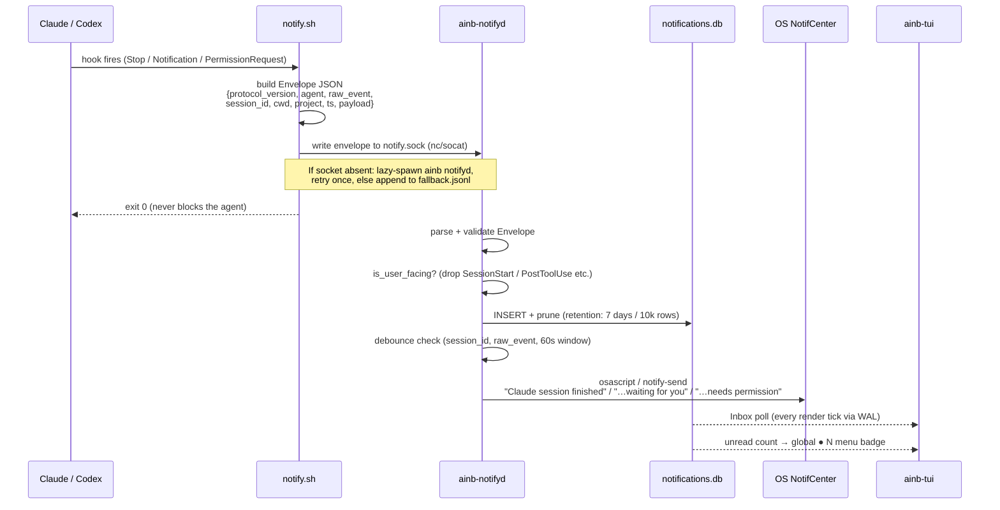

The **Inbox** screen and the **`ainb-notifyd`** daemon are part of the `ainb` host binary — **not** an ainb plugin. This page documents them together because they are two halves of one feature: the daemon captures Claude Code / Codex lifecycle hook events into SQLite, and the Inbox screen (plus the per-session attention markers) renders them inside `ainb-tui`.

> **Why it's not a plugin.** The crate is *named* `ainb-plugin-notifyd` (it lives alongside the example plugin crates), but it has no `manifest.toml`, no JSON-RPC boundary, and is never spawned as a subprocess. `ainb-core` links it as an ordinary Rust path-dependency and compiles it straight into the host. Contrast with the real v2 subprocess plugins — `burndown`, `session-reader`, `witr` — which run as spawned child processes over stdio JSON-RPC. The **only** plugin in this feature is [`ainb-hooks`](../toolkit/plugins/ainb-hooks.md), a thin bash hook installed into Claude Code and Codex CLI — not into `ainb`.



*Press `b` anywhere in ainb to open the Inbox — captured Claude Code / Codex lifecycle events with a list + detail pane, agent filter, and per-session unread badges.*

## Architecture

### End-to-end flow



> The per-session **`[?]` marker is live state**, derived from the tmux
> pane — **not** from the notifications database. The database backs the
> Inbox screen and the global unread badge; the session-list marker
> reflects what a session is doing *right now*.

### Single-event sequence



### Data flow legend

| Path | Details |
|---|---|
| Hook → socket | One newline-terminated JSON line per event; `nc -U` or `socat` |
| Fallback file | `~/.agents-in-a-box/notify.fallback.jsonl` — replayed + cleared on daemon start |
| Database | `~/.agents-in-a-box/notifications.db` — WAL mode, separate from `usage.db` |
| OS banner | macOS: `osascript -e 'display notification …'`; Linux: `notify-send --app-name=ainb` |
| TUI poll | `Store::list(…, LIMIT 200)` on every render tick; cheap via WAL |
| cwd bridge | Inbox `Enter` resolves a row's `cwd` to the matching `Session.workspace_path` (exact or subdir) and attaches into that session's tmux |

### What gets filtered

Telemetry events are intentionally excluded at two layers:

1. **Hook registration** — `plugin.json` and `hooks.json` register only `Notification` and `Stop`. `SessionStart`, `UserPromptSubmit`, `PostToolUse`, `PreCompact` are **not registered**.
2. **Daemon filter** — `is_user_facing()` (`osnotify.rs:67`) drops any non-actionable event that arrives anyway (e.g. from a stale install or future hook changes). Only `Stop`, `Notification`, `PermissionRequest`, `agent-turn-complete`, `task_complete`, `request_user_input`, `exec_approval_request`, `apply_patch_approval_request`, `wait_for_user`, `permission_request` pass the filter.

`PostToolUse` alone fires dozens of times per turn. Without these filters, the inbox would be unusable.

## Install

The `ainb-hooks` plugin is installed into your agent CLIs via the `ainb notifyd install` subcommand (also available as the standalone `ainb-notifyd` binary):

```bash
# Install for both Claude Code and Codex CLI (default)
ainb notifyd install

# Claude only
ainb notifyd install --claude

# Codex only
ainb notifyd install --codex

# Check status
ainb notifyd status

# Remove
ainb notifyd uninstall
ainb notifyd uninstall --claude
ainb notifyd uninstall --codex
```

All plugin files are baked into the binary via `include_str!` at compile time — no network, no separate download.

**What `install` writes to disk:**

| Path | What |
|---|---|
| `~/.agents-in-a-box/hooks/notify.sh` | Canonical hook script (chmod 755) — single source of truth |
| `~/.claude/plugins/ainb-hooks/.claude-plugin/plugin.json` | Claude Code plugin manifest |
| `~/.claude/plugins/ainb-hooks/hooks/notify.sh` | Symlink (or copy) → canonical script |
| `~/.codex/hooks.json` | Managed block merged in; user hooks are preserved, never overwritten |
| `~/.agents-in-a-box/install.json` | Install record + `plugin_version` for drift detection |

**The install command does NOT start the daemon.** The daemon is lazy-spawned by `notify.sh` on the first event after install. See [Daemon management](#daemon-management) below.

> **Hooks load at session start.** Already-running Claude / Codex sessions will not pick up the newly installed hook until they are restarted. Inside a running Claude session, run `/hooks` to confirm `ainb-hooks` is listed.

### First-run prompt and drift detection

On startup, `ainb-tui` calls `prompt_state()` (`install.rs:242`):

- **Nothing installed + user hasn't declined** → offers to install (`OfferInstall`).
- **Installed, but the running binary embeds a newer manifest** → offers to re-install (`OfferUpdate { installed, embedded }`). This fires after an `ainb` upgrade.
- **Up to date or user declined** → silent (`None`).

Declining the first-run prompt sets `prompt_dismissed = true` in `install.json` and suppresses the offer permanently. Re-installing clears that flag.

## What you see

### Surface 1 — OS notification banner

<!-- SCREENSHOT: macOS Notification Center banner showing "Claude session finished" or "Claude is waiting for you" — caption: "Native macOS banner emitted when a session finishes or parks at a prompt" -->

Fires when:
- The daemon is running, **and**
- The event passes `is_user_facing()`, **and**
- The `(session_id, raw_event)` pair has not fired within the last 60 seconds (debounce window).

Banner titles:

| Event | Title |
|---|---|
| `Stop`, `agent-turn-complete`, `task_complete` | `Claude / Codex session finished` |
| `Notification`, `request_user_input`, `wait_for_user` | `Claude / Codex is waiting for you` |
| `PermissionRequest`, `exec_approval_request`, `apply_patch_approval_request`, `permission_request` | `Claude / Codex needs permission` |

The banner body is taken from `payload.message` if present; otherwise falls back to the project name or `cwd`.

On macOS, `osascript -e 'display notification …'` is used — no extra dependencies required. If no banner appears, check Notification Center permissions for the terminal host (see [Troubleshooting](#troubleshooting)).

### Surface 2 — per-session attention marker in the session list

<!-- SCREENSHOT: Session list showing an amber [?] tag on a session parked at /interview or AskUserQuestion — caption: "A session parked at an interactive prompt shows [?] in the session list" -->

The session list renders a colored marker to the right of the session name when `session.live_attention` is set. This value is derived from the tmux pane state every ~5 seconds (`AppState::live_attention_from_pane`) — **not** from notification history, so it reflects what the session is doing *right now* and clears the moment the session resumes.

| Marker | Color | Meaning |
|---|---|---|
| `[?]` | Amber | Agent is parked at an interactive prompt — `/interview`, AskUserQuestion, or a permission prompt — and needs you (`AlertKind::WaitingOnUser`) |

Today, live detection emits **only `[?]`**: a session is "waiting" when its agent is not generating *and* the visible screen tail shows a box-drawn prompt panel containing `?`. Sessions that are actively working or idle show **no marker** — those states are already conveyed by the row's `●` / `○` status indicator, so a marker there would be redundant.

> **Reserved variants.** The renderer (`session_list.rs`) also maps `AlertKind::NeedsPermission` → red `[!]` and `AlertKind::Finished` → green `[✓]`, but the live pane detector does not currently emit them — they're reserved for future, more granular detection (e.g. distinguishing a permission prompt from a question, or a transient "just finished" state). You will only see `[?]` in the current release.

### Surface 3 — global unread badge in the menu bar

<!-- SCREENSHOT: Bottom menu bar showing "● 3 · b inbox" when unread notifications are present — caption: "Global unread badge in the menu bar; press b to open the Inbox" -->

Visible on every split-pane screen. When `Store::unread_count()` > 0, the Inbox hint becomes `● N · b inbox` where N is the total count of unread + non-dismissed events. When the count is zero, the hint shows only `b inbox`.

### Surface 4 — Inbox screen

<!-- SCREENSHOT: Inbox screen with the two-pane list + detail view showing several notification rows — caption: "The Inbox screen (press b) with list and detail panes" -->

Press **`b`** from the home screen (or `Enter` on the `📥 Inbox` sidebar tile) to open the Inbox. It shows a two-pane list + detail view of all captured events, newest first.

**Key bindings inside the Inbox:**

| Key | Action |
|---|---|
| `↑` / `↓` or `k` / `j` | Move selection |
| `PageUp` / `PageDown` | Jump 10 rows |
| `Enter` | Open detail + mark read + jump to the matching session's tmux pane |
| `d` | Dismiss selected row |
| `Shift+C` | Dismiss every currently-visible row |
| `a` | Toggle archived (dismissed) rows |
| `p` | Cycle agent filter: all → claude → codex → all |
| `r` | Force refresh from store |
| `q` / `Esc` | Return to previous screen |

**Jump-to-tmux on Enter:** every envelope carries the agent's `cwd` at hook-fire time. When you press `Enter` on an Inbox row, `ainb` resolves the row's `cwd` against `Session.workspace_path` (exact match or `workspace_path/`-prefix for worktree subdirs), picks the matching session, and issues an `AttachToOtherTmux` action. The host agent's `session_id` string and ainb's internal `Uuid` are in separate namespaces — `cwd` is the correlation bridge.

## Daemon management

The daemon is **not started by `install`**. `notify.sh` lazy-spawns it (`nohup ainb notifyd &`) on the first event after a session starts. This is normal — seeing the daemon absent in `status` before any event has fired is expected.

```bash
# Check status (install + daemon report — read-only, always safe)
ainb notifyd status

# Run daemon in foreground (useful for debugging)
ainb notifyd run

# Stop a running daemon (sends SIGTERM via PID file)
ainb notifyd stop
```

`ainb notifyd` and `ainb-notifyd` are the same code — the former is a hidden subcommand on the main `ainb` binary (guaranteed to be on `PATH`), the latter is the standalone daemon binary.

## How to check it's firing

**1. Status report:**

```bash
ainb notifyd status
```

Healthy output looks like:
```
agent    installed  hook_ok  socket_ok  last_event
claude   yes        yes      yes        Stop (claude)
codex    yes        yes      yes        Stop (codex)
```

**2. Query the database directly:**

```bash
sqlite3 ~/.agents-in-a-box/notifications.db \
  "SELECT agent, raw_event, datetime(ts/1000,'unixepoch','localtime')
   FROM notifications ORDER BY ts DESC LIMIT 5;"
```

**3. Manual smoke-test — fire the hook directly:**

```bash
printf '{"hook_event_name":"Stop","session_id":"test","cwd":"'"$PWD"'","payload":{"message":"smoke-test"}}' \
  | AINB_AGENT=claude bash ~/.agents-in-a-box/hooks/notify.sh
```

After this runs:
- A row appears in `notifications.db`.
- A macOS banner pops (if the daemon is up and Notification Center permission is granted).
- `ainb notifyd status` shows `daemon: pid N (running)` and the last event.

## Troubleshooting

### No OS banner on macOS

The most common cause: Notification Center permission for the terminal (or `osascript`) is denied.

1. Open **System Settings → Notifications**.
2. Find your terminal app (Terminal, iTerm2, Ghostty, etc.) or `osascript`.
3. Enable "Allow notifications" and set alert style to "Alerts" or "Banners".

Confirm the daemon is up: `ainb notifyd status`. If `socket_ok: no`, the daemon hasn't started yet — fire a smoke-test event (see above) to trigger the lazy spawn.

### Installed a session hook, but events aren't appearing

Hooks load at **session start**. An already-running Claude or Codex session will not pick up the hook until it is restarted.

Confirm inside a running Claude session:
```
/hooks
```
`ainb-hooks` must appear in the hook list. If it's absent, restart the Claude session.

### Daemon not running (socket_ok: no)

This is normal before the first event fires. The daemon is lazy-spawned by `notify.sh` on first use. To start it manually:

```bash
ainb notifyd run &
# or foreground for debugging:
ainb notifyd run
```

If `ainb notifyd run` immediately exits, check `~/.agents-in-a-box/notify.pid` — another instance may already be running.

### Events accumulating in notify.fallback.jsonl

The fallback file is written when delivery to the socket fails (daemon not running at the time). They are replayed and cleared automatically on the next daemon startup. You can force replay by running `ainb notifyd run` — it drains the fallback file before binding the socket.

### Inbox shows old / stale events

Press `r` inside the Inbox to force a store refresh. The default poll is every render tick; if the display looks wrong, `r` guarantees a fresh read.

## Host resources

Because `notifyd` is host code (not a subprocess plugin), there is no capability declaration. For reference:

| Resource | Purpose |
|---|---|
| `~/.agents-in-a-box/notifications.db` (SQLite, read+write) | Persist envelopes; back the Inbox list and unread badge |
| `~/.agents-in-a-box/notify.sock` (Unix socket, `0600`) | Receive envelopes from `notify.sh` |
| `~/.agents-in-a-box/notify.pid` | Single-instance guard; used by `stop` verb |
| `~/.agents-in-a-box/notify.fallback.jsonl` | Buffer events queued while daemon was down |
| `~/.agents-in-a-box/install.json` | Install record + plugin version for drift detection |
| `~/.claude/plugins/ainb-hooks/`, `~/.codex/hooks.json` | Written by `install` / `uninstall` verbs |
| `osascript` / `notify-send` (subprocess) | Native OS notification |

Retention defaults: 7 days, 10,000 rows maximum. Oldest rows pruned on every insert.

## Source

| Crate / file | Purpose |
|---|---|
| `ainb-tui/crates/ainb-plugin-notifyd/` | Daemon binary + library: envelope wire format, SQLite store, tokio listener, OS-notify dispatch, install/uninstall logic |
| `ainb-tui/crates/ainb-core/src/components/inbox.rs` | Inbox TUI screen |
| `ainb-tui/crates/ainb-core/src/components/session_list.rs` | Per-session live `[?]` waiting marker |
| `ainb-tui/crates/ainb-core/src/app/state.rs` | `live_attention_from_pane` — derives the marker from the tmux pane |
| `plugins/ainb-hooks/` | Hook plugin source: `notify.sh`, `plugin.json`, `codex/hooks.json` |
